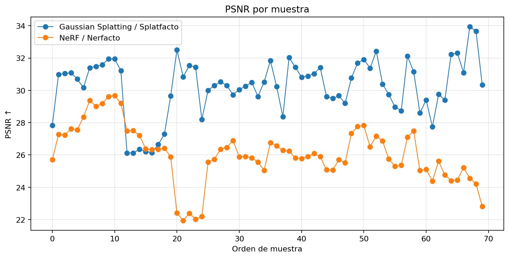
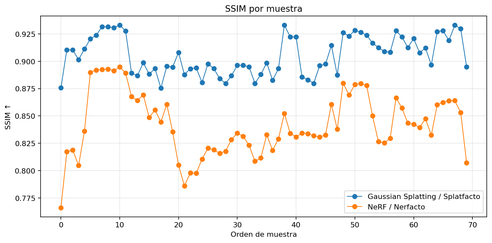
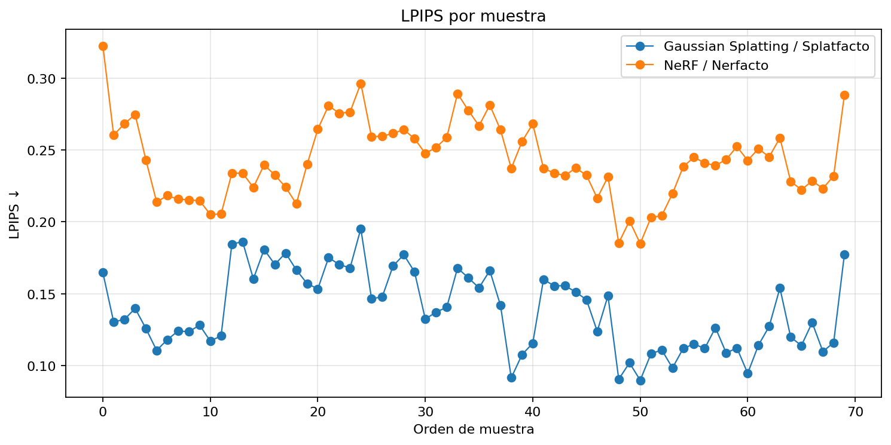
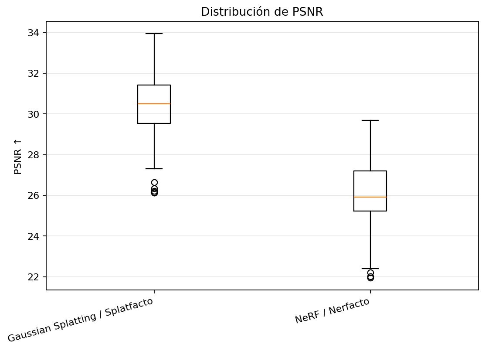
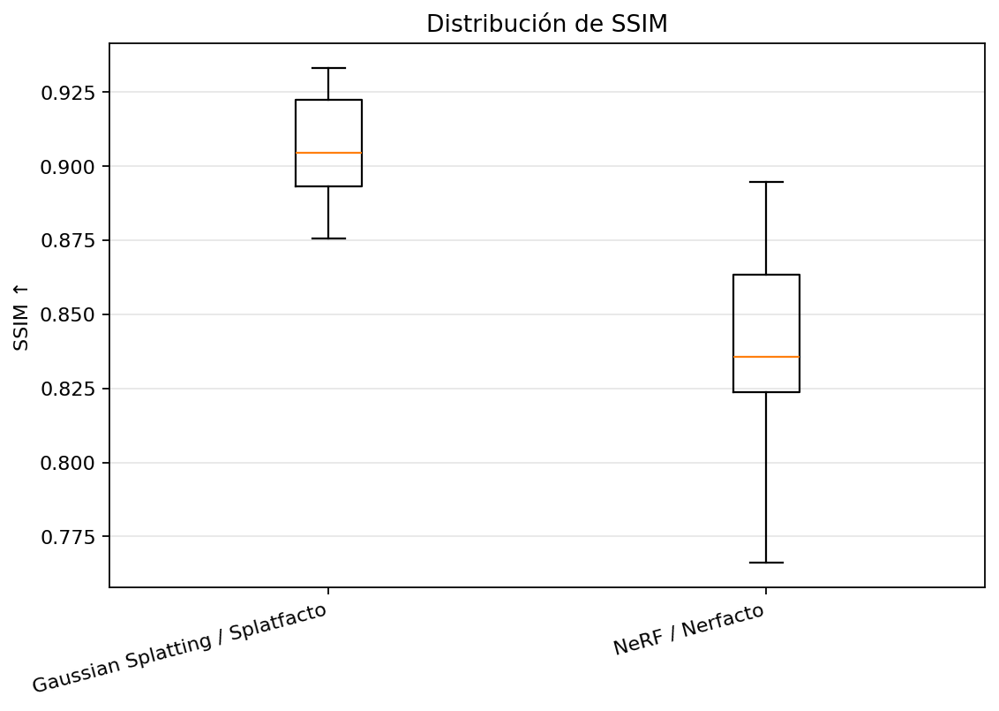
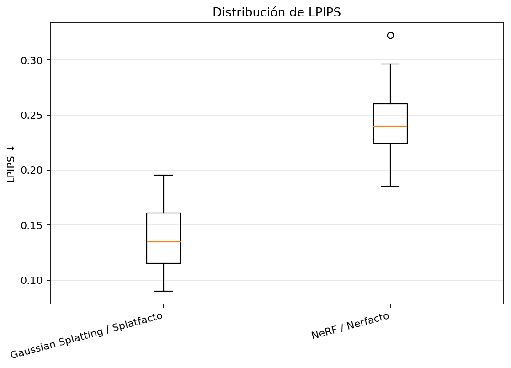
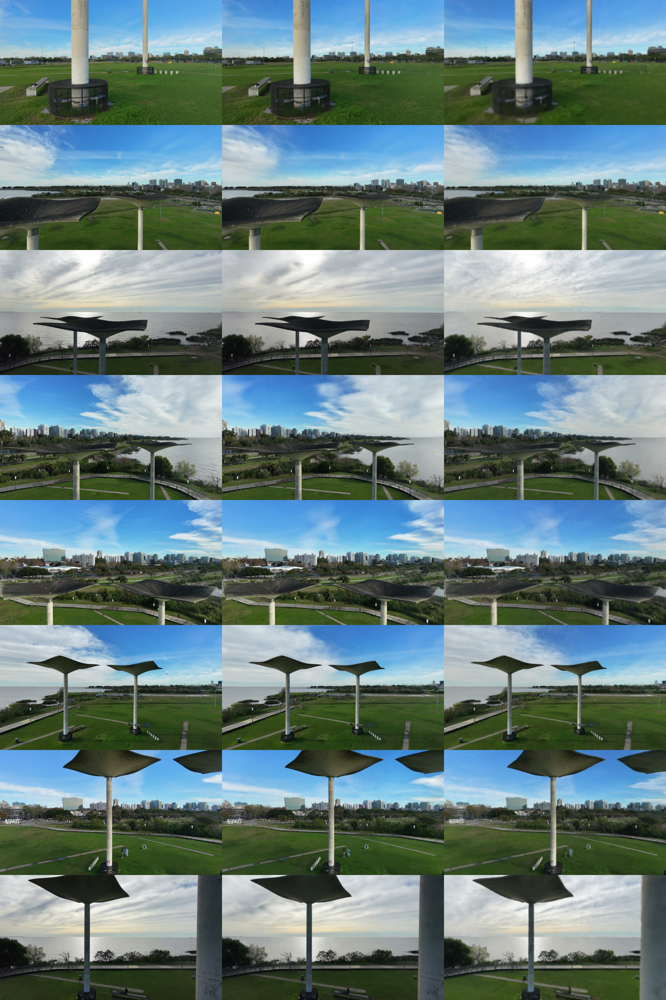
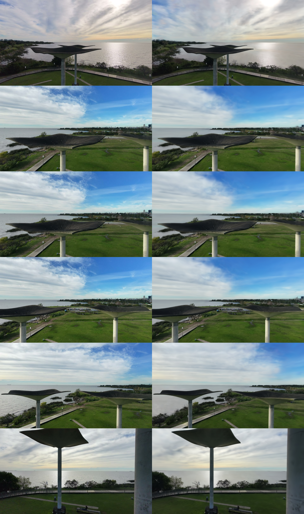
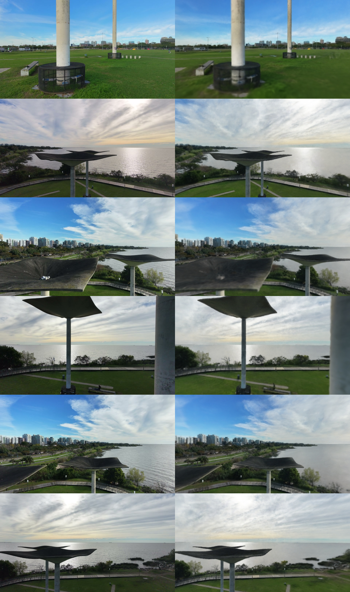

# Informe de benchmark: Original vs Splatfacto vs Nerfacto

## 1. Objetivo

Este informe resume la evaluación cuantitativa y cualitativa de los renders generados con **Gaussian Splatting / Splatfacto** y **NeRF / Nerfacto**, comparándolos contra imágenes originales del dataset.

Las métricas utilizadas fueron **PSNR**, **SSIM**, **LPIPS**, **MSE** y **MAE**.

## 2. Configuración experimental

- Carpeta del proyecto: `/content/drive/MyDrive/Tesis: Tecnicas de CV para Reconstruccion Arquitectonica/notebooks`
- Carpeta de resultados: `/content/drive/MyDrive/Tesis: Tecnicas de CV para Reconstruccion Arquitectonica/notebooks/benchmark_outputs`
- Dataset original: `/content/drive/MyDrive/Tesis: Tecnicas de CV para Reconstruccion Arquitectonica/notebooks/datasets/original`
- Dataset Splatfacto: `/content/drive/MyDrive/Tesis: Tecnicas de CV para Reconstruccion Arquitectonica/notebooks/datasets/splatfacto`
- Dataset Nerfacto: `/content/drive/MyDrive/Tesis: Tecnicas de CV para Reconstruccion Arquitectonica/notebooks/datasets/nerfacto`
- Imágenes originales detectadas: `637`
- Imágenes Splatfacto detectadas: `637`
- Imágenes Nerfacto detectadas: `637`
- Pares disponibles para evaluación: `637`
- Tamaño de muestra evaluada: `70`
- Modo de muestreo: `random`
- Semilla aleatoria: `42`
- Método de emparejamiento: `order`
- Resolución normalizada: `(960, 540)`
- Recorte central: `None`

## 3. Resumen de métricas

| method                          |   n |   psnr_mean |   psnr_std |   psnr_min |   psnr_max |   ssim_mean |   ssim_std |   ssim_min |   ssim_max |   lpips_mean |   lpips_std |   lpips_min |   lpips_max |   mse_mean |   mae_mean |
|:--------------------------------|----:|------------:|-----------:|-----------:|-----------:|------------:|-----------:|-----------:|-----------:|-------------:|------------:|------------:|------------:|-----------:|-----------:|
| Gaussian Splatting / Splatfacto |  70 |     30.2297 |     1.7762 |    26.1236 |    33.9512 |      0.9056 |     0.0176 |     0.8755 |     0.9331 |       0.1384 |      0.0273 |      0.0898 |      0.1953 |     0.001  |     0.0197 |
| NeRF / Nerfacto                 |  70 |     26.0763 |     1.7338 |    21.9471 |    29.68   |      0.8422 |     0.0284 |     0.7662 |     0.8948 |       0.2427 |      0.0268 |      0.1849 |      0.3225 |     0.0027 |     0.0371 |

## 4. Lectura automática inicial

- Mejor método en **PSNR**: **Gaussian Splatting / Splatfacto** (`30.2297`).
- Mejor método en **SSIM**: **Gaussian Splatting / Splatfacto** (`0.9056`).
- Mejor método en **LPIPS**: **Gaussian Splatting / Splatfacto** (`0.1384`).

Criterio de lectura:

- **PSNR** más alto indica mejor coincidencia píxel a píxel.
- **SSIM** más alto indica mejor preservación estructural.
- **LPIPS** más bajo indica mejor similitud perceptual.
- Las métricas deben complementarse con lectura cualitativa, porque pequeñas diferencias de cámara, exposición, nitidez o alineación pueden afectar la comparación.

## 5. Mejores y peores casos

### Gaussian Splatting / Splatfacto

**Mejores casos por PSNR**

|   sample_order |   pair_index | original_name   | pred_name       |    psnr |
|---------------:|-------------:|:----------------|:----------------|--------:|
|             67 |          618 | frame_00619.jpg | frame_00687.jpg | 33.9512 |
|             68 |          623 | frame_00624.jpg | frame_00692.jpg | 33.6601 |
|             20 |          159 | frame_00160.jpg | frame_00177.jpg | 32.5115 |
|             52 |          432 | frame_00433.jpg | frame_00480.jpg | 32.4252 |
|             65 |          604 | frame_00605.jpg | frame_00671.jpg | 32.3187 |

**Peores casos por LPIPS**

|   sample_order |   pair_index | original_name   | pred_name       |   lpips |
|---------------:|-------------:|:----------------|:----------------|--------:|
|             24 |          175 | frame_00176.jpg | frame_00195.jpg |  0.1953 |
|             13 |           95 | frame_00096.jpg | frame_00106.jpg |  0.1862 |
|             12 |           94 | frame_00095.jpg | frame_00105.jpg |  0.1845 |
|             15 |          103 | frame_00104.jpg | frame_00115.jpg |  0.1808 |
|             17 |          114 | frame_00115.jpg | frame_00127.jpg |  0.1783 |

### NeRF / Nerfacto

**Mejores casos por PSNR**

|   sample_order |   pair_index | original_name   | pred_name       |    psnr |
|---------------:|-------------:|:----------------|:----------------|--------:|
|             10 |           81 | frame_00082.jpg | frame_00090.jpg | 29.68   |
|              9 |           80 | frame_00081.jpg | frame_00089.jpg | 29.6085 |
|              6 |           46 | frame_00047.jpg | frame_00052.jpg | 29.367  |
|             11 |           89 | frame_00090.jpg | frame_00099.jpg | 29.2018 |
|              8 |           73 | frame_00074.jpg | frame_00082.jpg | 29.1775 |

**Peores casos por LPIPS**

|   sample_order |   pair_index | original_name   | pred_name       |   lpips |
|---------------:|-------------:|:----------------|:----------------|--------:|
|              0 |            6 | frame_00007.jpg | frame_00007.jpg |  0.3225 |
|             24 |          175 | frame_00176.jpg | frame_00195.jpg |  0.2964 |
|             33 |          238 | frame_00239.jpg | frame_00265.jpg |  0.2893 |
|             69 |          633 | frame_00634.jpg | frame_00703.jpg |  0.2883 |
|             36 |          273 | frame_00274.jpg | frame_00304.jpg |  0.2813 |

## 6. Muestra evaluada

Primeros 15 pares muestreados:

|   pair_index | original_path                                                                                                               | splatfacto_path                                                                                                               | nerfacto_path                                                                                                               | original_name   | splatfacto_name   | nerfacto_name   |   sample_order |
|-------------:|:----------------------------------------------------------------------------------------------------------------------------|:------------------------------------------------------------------------------------------------------------------------------|:----------------------------------------------------------------------------------------------------------------------------|:----------------|:------------------|:----------------|---------------:|
|            6 | /content/drive/MyDrive/Tesis: Tecnicas de CV para Reconstruccion Arquitectonica/notebooks/datasets/original/frame_00007.jpg | /content/drive/MyDrive/Tesis: Tecnicas de CV para Reconstruccion Arquitectonica/notebooks/datasets/splatfacto/frame_00007.jpg | /content/drive/MyDrive/Tesis: Tecnicas de CV para Reconstruccion Arquitectonica/notebooks/datasets/nerfacto/frame_00007.jpg | frame_00007.jpg | frame_00007.jpg   | frame_00007.jpg |              0 |
|           25 | /content/drive/MyDrive/Tesis: Tecnicas de CV para Reconstruccion Arquitectonica/notebooks/datasets/original/frame_00026.jpg | /content/drive/MyDrive/Tesis: Tecnicas de CV para Reconstruccion Arquitectonica/notebooks/datasets/splatfacto/frame_00028.jpg | /content/drive/MyDrive/Tesis: Tecnicas de CV para Reconstruccion Arquitectonica/notebooks/datasets/nerfacto/frame_00028.jpg | frame_00026.jpg | frame_00028.jpg   | frame_00028.jpg |              1 |
|           27 | /content/drive/MyDrive/Tesis: Tecnicas de CV para Reconstruccion Arquitectonica/notebooks/datasets/original/frame_00028.jpg | /content/drive/MyDrive/Tesis: Tecnicas de CV para Reconstruccion Arquitectonica/notebooks/datasets/splatfacto/frame_00030.jpg | /content/drive/MyDrive/Tesis: Tecnicas de CV para Reconstruccion Arquitectonica/notebooks/datasets/nerfacto/frame_00030.jpg | frame_00028.jpg | frame_00030.jpg   | frame_00030.jpg |              2 |
|           30 | /content/drive/MyDrive/Tesis: Tecnicas de CV para Reconstruccion Arquitectonica/notebooks/datasets/original/frame_00031.jpg | /content/drive/MyDrive/Tesis: Tecnicas de CV para Reconstruccion Arquitectonica/notebooks/datasets/splatfacto/frame_00034.jpg | /content/drive/MyDrive/Tesis: Tecnicas de CV para Reconstruccion Arquitectonica/notebooks/datasets/nerfacto/frame_00034.jpg | frame_00031.jpg | frame_00034.jpg   | frame_00034.jpg |              3 |
|           32 | /content/drive/MyDrive/Tesis: Tecnicas de CV para Reconstruccion Arquitectonica/notebooks/datasets/original/frame_00033.jpg | /content/drive/MyDrive/Tesis: Tecnicas de CV para Reconstruccion Arquitectonica/notebooks/datasets/splatfacto/frame_00036.jpg | /content/drive/MyDrive/Tesis: Tecnicas de CV para Reconstruccion Arquitectonica/notebooks/datasets/nerfacto/frame_00036.jpg | frame_00033.jpg | frame_00036.jpg   | frame_00036.jpg |              4 |
|           44 | /content/drive/MyDrive/Tesis: Tecnicas de CV para Reconstruccion Arquitectonica/notebooks/datasets/original/frame_00045.jpg | /content/drive/MyDrive/Tesis: Tecnicas de CV para Reconstruccion Arquitectonica/notebooks/datasets/splatfacto/frame_00049.jpg | /content/drive/MyDrive/Tesis: Tecnicas de CV para Reconstruccion Arquitectonica/notebooks/datasets/nerfacto/frame_00049.jpg | frame_00045.jpg | frame_00049.jpg   | frame_00049.jpg |              5 |
|           46 | /content/drive/MyDrive/Tesis: Tecnicas de CV para Reconstruccion Arquitectonica/notebooks/datasets/original/frame_00047.jpg | /content/drive/MyDrive/Tesis: Tecnicas de CV para Reconstruccion Arquitectonica/notebooks/datasets/splatfacto/frame_00052.jpg | /content/drive/MyDrive/Tesis: Tecnicas de CV para Reconstruccion Arquitectonica/notebooks/datasets/nerfacto/frame_00052.jpg | frame_00047.jpg | frame_00052.jpg   | frame_00052.jpg |              6 |
|           71 | /content/drive/MyDrive/Tesis: Tecnicas de CV para Reconstruccion Arquitectonica/notebooks/datasets/original/frame_00072.jpg | /content/drive/MyDrive/Tesis: Tecnicas de CV para Reconstruccion Arquitectonica/notebooks/datasets/splatfacto/frame_00079.jpg | /content/drive/MyDrive/Tesis: Tecnicas de CV para Reconstruccion Arquitectonica/notebooks/datasets/nerfacto/frame_00079.jpg | frame_00072.jpg | frame_00079.jpg   | frame_00079.jpg |              7 |
|           73 | /content/drive/MyDrive/Tesis: Tecnicas de CV para Reconstruccion Arquitectonica/notebooks/datasets/original/frame_00074.jpg | /content/drive/MyDrive/Tesis: Tecnicas de CV para Reconstruccion Arquitectonica/notebooks/datasets/splatfacto/frame_00082.jpg | /content/drive/MyDrive/Tesis: Tecnicas de CV para Reconstruccion Arquitectonica/notebooks/datasets/nerfacto/frame_00082.jpg | frame_00074.jpg | frame_00082.jpg   | frame_00082.jpg |              8 |
|           80 | /content/drive/MyDrive/Tesis: Tecnicas de CV para Reconstruccion Arquitectonica/notebooks/datasets/original/frame_00081.jpg | /content/drive/MyDrive/Tesis: Tecnicas de CV para Reconstruccion Arquitectonica/notebooks/datasets/splatfacto/frame_00089.jpg | /content/drive/MyDrive/Tesis: Tecnicas de CV para Reconstruccion Arquitectonica/notebooks/datasets/nerfacto/frame_00089.jpg | frame_00081.jpg | frame_00089.jpg   | frame_00089.jpg |              9 |
|           81 | /content/drive/MyDrive/Tesis: Tecnicas de CV para Reconstruccion Arquitectonica/notebooks/datasets/original/frame_00082.jpg | /content/drive/MyDrive/Tesis: Tecnicas de CV para Reconstruccion Arquitectonica/notebooks/datasets/splatfacto/frame_00090.jpg | /content/drive/MyDrive/Tesis: Tecnicas de CV para Reconstruccion Arquitectonica/notebooks/datasets/nerfacto/frame_00090.jpg | frame_00082.jpg | frame_00090.jpg   | frame_00090.jpg |             10 |
|           89 | /content/drive/MyDrive/Tesis: Tecnicas de CV para Reconstruccion Arquitectonica/notebooks/datasets/original/frame_00090.jpg | /content/drive/MyDrive/Tesis: Tecnicas de CV para Reconstruccion Arquitectonica/notebooks/datasets/splatfacto/frame_00099.jpg | /content/drive/MyDrive/Tesis: Tecnicas de CV para Reconstruccion Arquitectonica/notebooks/datasets/nerfacto/frame_00099.jpg | frame_00090.jpg | frame_00099.jpg   | frame_00099.jpg |             11 |
|           94 | /content/drive/MyDrive/Tesis: Tecnicas de CV para Reconstruccion Arquitectonica/notebooks/datasets/original/frame_00095.jpg | /content/drive/MyDrive/Tesis: Tecnicas de CV para Reconstruccion Arquitectonica/notebooks/datasets/splatfacto/frame_00105.jpg | /content/drive/MyDrive/Tesis: Tecnicas de CV para Reconstruccion Arquitectonica/notebooks/datasets/nerfacto/frame_00105.jpg | frame_00095.jpg | frame_00105.jpg   | frame_00105.jpg |             12 |
|           95 | /content/drive/MyDrive/Tesis: Tecnicas de CV para Reconstruccion Arquitectonica/notebooks/datasets/original/frame_00096.jpg | /content/drive/MyDrive/Tesis: Tecnicas de CV para Reconstruccion Arquitectonica/notebooks/datasets/splatfacto/frame_00106.jpg | /content/drive/MyDrive/Tesis: Tecnicas de CV para Reconstruccion Arquitectonica/notebooks/datasets/nerfacto/frame_00106.jpg | frame_00096.jpg | frame_00106.jpg   | frame_00106.jpg |             13 |
|           99 | /content/drive/MyDrive/Tesis: Tecnicas de CV para Reconstruccion Arquitectonica/notebooks/datasets/original/frame_00100.jpg | /content/drive/MyDrive/Tesis: Tecnicas de CV para Reconstruccion Arquitectonica/notebooks/datasets/splatfacto/frame_00110.jpg | /content/drive/MyDrive/Tesis: Tecnicas de CV para Reconstruccion Arquitectonica/notebooks/datasets/nerfacto/frame_00110.jpg | frame_00100.jpg | frame_00110.jpg   | frame_00110.jpg |             14 |

## 7. Gráficos e imágenes

Los siguientes gráficos fueron generados por el notebook:

### psnr_curve.png

### ssim_curve.png

### lpips_curve.png

### psnr_boxplot.png

### ssim_boxplot.png

### lpips_boxplot.png

### comparison_grid_original_splatfacto_nerfacto.png

### worst_lpips_gaussian_splatting_splatfacto.png

### worst_lpips_nerf_nerfacto.png

## 8. Conclusión preliminar

A partir de los resultados cuantitativos y cualitativos, el benchmark permite discutir cuál de los métodos ofrece mejor fidelidad visual, continuidad estructural y similitud perceptual frente al dataset original. Para la tesis, se recomienda complementar estas métricas con una lectura arquitectónica de los casos más representativos y con una comparación geométrica separada para la fotogrametría.
