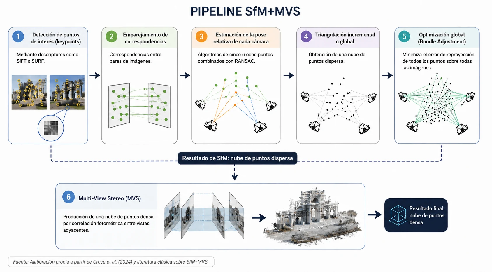
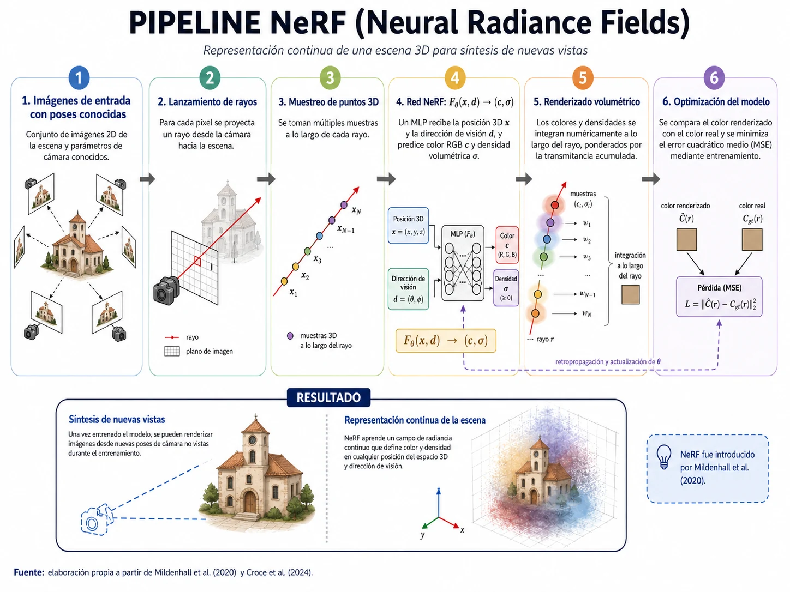
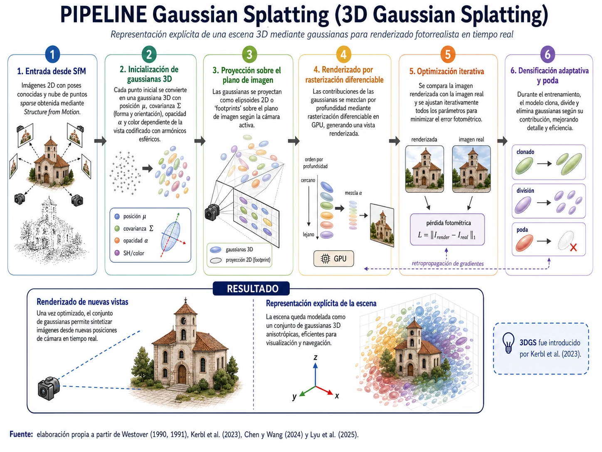
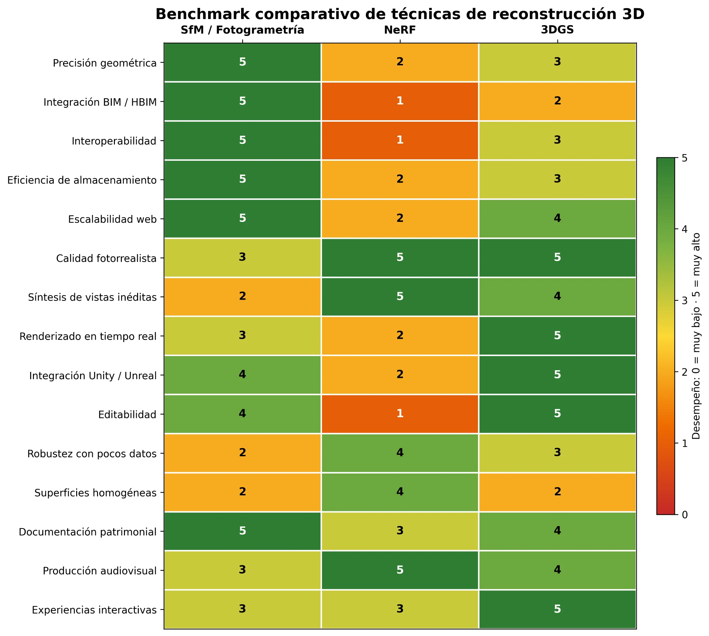

**CAPÍTULO 2**

**Marco teórico y estado del arte**

El presente capítulo sistematiza los fundamentos teóricos y el estado del arte de las tres familias de técnicas de reconstrucción tridimensional a partir de imágenes que constituyen el objeto de estudio de esta tesis: la fotogrametría basada en Structure from Motion (SfM), las redes neuronales de representación implícita conocidas como Neural Radiance Fields (NeRFs) y el método de Gaussian Splatting (3DGS). Se comienza por establecer una definición de patrimonio arquitectónico nacional que encuadra el problema desde una perspectiva histórica, internacional y argentina. Se revisan luego los principios algorítmicos de cada técnica, su genealogía terminológica, sus casos de uso específicos en la industria y las herramientas de software disponibles para su implementación. El capítulo cierra con una síntesis comparativa orientada a los criterios de selección de esta investigación y un glosario de términos.

**<u>2.1 El objeto de estudio: patrimonio arquitectónico argentino</u>**

A los efectos de esta investigación, se entiende por **patrimonio arquitectónico nacional** a la definición creada por el autor argentino Alfredo Conti en su libro “El patrimonio como representación del "nosotros". El caso de Argentina.”, ahi el autor plantea al patrimonio como una construcción humana —bienes materiales e inmateriales a los que la sociedad asigna valores que lo constituyen como referente simbólico de identidad—. Su definición se apoya en la definición de Llorenç Prats elaborada en el libro Antropología y patrimonio de 1997, quien destaca que esta colección de edificios debe tener "capacidad para representar simbólicamente una identidad".

Lo que interesa a esta tesis no es el debate teórico sobre qué debe o no considerarse patrimonio, sino la constatación de que existe un corpus extenso de edificios argentinos con valor patrimonial reconocido que carece de documentación digital sistemática. Hay múltiples debates en torno a la preservación del patrimonio nacional, el libro “Entre la renovación edilicia y la preservación patrimonial” de María de las Mercedes Bracco plantea una tensión existente entre el carácter orgánico de las ciudades y la necesidad de una preservación de la arquitectura que permita construir una identidad cultural. Se data que en el año 1940, bajo la ley 12.665 se ordena la creación de Comisión Nacional de Museos y de Monumentos y Lugares Históricos, y una de las primeras responsabilidades vinculadas a la creación de este organismo es que se realice un censo nacional con el fin de identificar un “Registro de los bienes históricos e histórico-artísticos”. El libro menciona que en el año 1944, con la creación del Código de Edificación, se crea también un “registro de edificios de interés histórico”. Este antecedente marca uno de los primeros indicios de la creación de un archivo que pretende dar cuenta del historial de edificios que pertenecen a esta categoría, sin embargo desde 1944 hasta el presente existieron decenas de intentos de crear un registro nacional que pueda mantenerse actualizado y sea escalable en su mantenimiento. Si nos limitamos sólo a archivos nacionales digitales podemos afirmar que todos los registros de historial patrimonial digitales existentes contienen documentación bidimensional de las obras, desde imágenes hasta escaneos digitales de planos, alzadas y documentación técnica vinculada a la construcción de las obras. Un ejemplo es el Archivo de la Ciudad ([<u>https://archivodelaciudad.org/</u>](https://archivodelaciudad.org/)), creado por el gobierno de la Ciudad de Buenos Aires en 2021 y descontinuado en 2025, y el Portal Nacional de Arquitectura: ([<u>https://www.argentina.gob.ar/bienesdelestado/cediap-pp/portal-nacional-de-arquitectura</u>](https://www.argentina.gob.ar/bienesdelestado/cediap-pp/portal-nacional-de-arquitectura)) que cuenta con un historial de documentos de edificios publicos como el Teatro Colon y la Casa Rosada, por mencionar algunos, pero que tiene un listado limitado y donde solo se encuentran planos de las obras e imagenes de su documentación.

Que no existan archivos digitales para consultar el patrimonio dificulta la resolución de un conflicto que identifica Mercedes Bracco en su libro, sin la existencia de un archivo es difícil pensar que la tensión que ella menciona en cuanto a la preservación del carácter edilicio de la ciudad pueda resolverse, en sus palabras: "la necesidad de construir un relato unificador... constituyó una base ideológica fuerte que restringió la noción de patrimonio hasta hace pocas décadas". A esta problemática se suma otro aspecto importante: si los pocos archivos digitales existentes sólo contienen material bidimensional de las obras como planos y documentaciones es difícil mantener un registro que nos permita entender el estado actual de las mismas y operar de forma activa para promover su preservación o mantenimiento.

La digitalización tridimensional de estos edificios abre una oportunidad concreta: generar un archivo digital de referencia que persista más allá del deterioro físico de los objetos y que sea accesible, distribuible y enriquecido por múltiples actores sin requerir infraestructura costosa. Este objetivo introduce un criterio de evaluación central en esta tesis —el peso del archivo de output— que se suma al de calidad visual: para que un repositorio patrimonial sea verdaderamente escalable, los modelos generados deben poder distribuirse y visualizarse sin hardware especializado ni anchos de banda extraordinarios. Lo que nos permitirá conseguir este historial de archivos tridimensionales de los edificios patrimoniales a escala nacional es:  
a) **Trazar una diferencia entre la arquitectura documentada y la construida:** La representación tridimensional que obtendremos utilizando fotogrametría, neural radiante fields y gaussian splatting permiten generar una reproducción de la obra en tres dimensiones a partir de la obra construida y no a partir de su documentación, por lo tanto la reproducción que consigamos puede llegar a ser más fiel que la documentación que se generó para construir la obra.

b\) **Tener un histórico del estado de la obra en tiempo real en el momento de la captura:** El archivo generado va a plasmar con detalle la obra en el instante en el cual se generó el registro, permitiendo también capturar aquellas patologías que aparecen en la misma con el paso del tiempo, como manchas de humedad, deterioros en la pintura, y demás registros. Algo que permitiría a un equipo de restauración realizar análisis de diagnóstico de los edificios que pueden utilizarse en posteriori para un plan de restauración. Por otro lado, la naturaleza del registro capturado en tiempo real permite comparar la obra con el paso del tiempo y obtener un timelapse de su transformación o deterioro.

c\) **Habilitar un archivo digital disponible para todos:** La democratización de la información y el acceso indiscriminado propone no sólo difundir la cultura del país sino también agilizar el desarrollo de nuevas e innovadoras investigaciones que pongan en foco en la historia arquitectónica del país y su legado.

Para concretar la creación de este archivo tridimensional accesible y escalable, resulta fundamental analizar las herramientas tecnológicas que permiten la captura y representación digital del patrimonio. A continuación, se examinan las tres familias de técnicas de reconstrucción 3D que constituyen el núcleo metodológico de esta investigación: la fotogrametría basada en Structure from Motion (SfM), los Neural Radiance Fields (NeRFs) y el método de Gaussian Splatting (3DGS). El estudio técnico que sigue no solo define sus fundamentos algorítmicos y su genealogía, sino que también evalúa su capacidad para responder a los desafíos específicos de documentación patrimonial, interoperabilidad y eficiencia que se plantearon en la sección anterior.

**<u>2.2 Fotogrametría basada en Structure from Motion (SfM)</u>**

**2.2.1 Genealogía del término y antecedentes históricos**

El término **fotogrametría** fue introducido por Albrecht Meydenbauer en 1867, a partir de una denominación propuesta junto con Otto Kersten en el artículo *"Die Photogrammetrie"* (Grimm, 2007). Sin embargo, sus antecedentes metodológicos se remontan a los trabajos de Aimé Laussedat, quien aplicó fotografías a relevamientos topográficos durante la década de 1860 bajo la denominación de *metrophotography*. Laussedat es considerado el padre fundacional de la disciplina, al demostrar por primera vez la posibilidad de extraer información métrica tridimensional de imágenes bidimensionales (Polidori, 2020).

Por su parte, **Structure from Motion (SfM)** surge como problema formal dentro de la visión computacional con los trabajos de Shimon Ullman, particularmente su artículo de 1979 *"The interpretation of structure from motion"*, donde se estudia la recuperación de estructura tridimensional a partir del movimiento aparente en secuencias de imágenes (Ullman, 1979). La denominación *fotogrametría SfM* como convergencia de ambas tradiciones no tiene un único acto fundacional, sino que emerge progresivamente durante los años 2000 con el desarrollo de algoritmos automáticos de emparejamiento de puntos de interés y el abaratamiento del hardware de cómputo.

**2.2.2 Fundamentos del método**

El pipeline típico de SfM+MVS comprende cinco etapas: (1) detección de puntos de interés (*keypoints*) mediante descriptores como *Scale-Invariant Feature Transform* (SIFT) o *Speeded-Up Robust Features* (SURF); (2) emparejamiento de correspondencias entre pares de imágenes; (3) estimación de la pose relativa de cada cámara mediante algoritmos de cinco u ocho puntos combinados con *Random Sample Consensus* (RANSAC); (4) triangulación incremental o global para obtener una nube de puntos dispersa; y (5) optimización global mediante *Bundle Adjustment*, que minimiza el error de reproyección de todos los puntos sobre todas las imágenes. Sobre el resultado de SfM, el proceso *Multi-View Stereo* (MVS) produce una nube de puntos densa por correlación fotométrica entre vistas adyacentes (Croce et al., 2024).

**2.2.3 Fortalezas para la documentación patrimonial**

**Precisión geométrica y exactitud métrica.** El pipeline SfM+MVS produce nubes de puntos y mallas poligonales métricamente verificables mediante puntos de control georreferenciados, exportables en formatos estándar de la industria (.OBJ, .PLY, .E57) y compatibles con flujos de trabajo de BIM.

**Interoperabilidad con BIM y Revit.** Los modelos generados por SfM son directamente importables en Autodesk Revit, ArchiCAD y otras plataformas HBIM mediante plugins de nube de puntos (Autodesk ReCap, CloudCompare). Esta interoperabilidad convierte a SfM en la técnica más adecuada para equipos de restauración y gestión patrimonial que trabajen con flujos de trabajo BIM. Yu et al. (2025) confirman que SfM es la opción de mayor adaptabilidad para la integración con herramientas de documentación y análisis patrimonial profesional.

**Peso del archivo y escalabilidad del repositorio.** Los archivos generados por el pipeline SfM —nubes de puntos en formato .LAZ o .E57, mallas en .OBJ— son compactos y de compresión eficiente. Para un edificio de escala media, una malla texturizada de calidad patrimonial puede representarse en archivos de entre 50 y 500 MB, directamente visualizables en plataformas web mediante formatos como .glTF o .3DTiles, lo que los hace especialmente adecuados para construir un repositorio digital de patrimonio argentino distribuible y accesible.

**2.2.4 Limitaciones**

El método presenta dificultades en superficies con propiedades ópticas complejas —materiales altamente reflectantes, superficies translúcidas o zonas con texturas uniformes— que dificultan el establecimiento de correspondencias fiables entre imágenes. Las sombras, los cambios de iluminación entre vistas y las oclusiones parciales también pueden degradar la calidad de la reconstrucción. Yu et al. (2025) señalan que SfM requiere en muchos casos intervención manual en el postproceso y enfrenta desafíos con superficies reflectantes o transparentes frecuentes en edificios históricos.

**2.2.5 Herramientas de software**

Entre las herramientas de código abierto, COLMAP es la referencia académica más utilizada. Meshroom (AliceVision) proporciona una interfaz nodal para la personalización del pipeline. Entre las soluciones comerciales, RealityCapture (Epic Games) y Agisoft Metashape son las más extendidas. Croce et al. (2024) reportan el uso de MicMac y Agisoft Metashape 2.1.0 en su investigación sobre patrimonio, destacando su capacidad para producir mallas texturizadas, nubes de puntos y ortofotografías rectificadas listas para integración métrica.

**<u>2.3 Neural Radiance Fields (NeRF)</u>**

**2.3.1 Genealogía del término y antecedentes históricos**

El término **Neural Radiance Fields** y su abreviatura **NeRF** fueron introducidos por Mildenhall et al. en su artículo *"NeRF: Representing Scenes as Neural Radiance Fields for View Synthesis"*, publicado como preprint en arXiv en marzo de 2020 y presentado en la ECCV 2020. En ese trabajo se propone representar una escena tridimensional como un campo de radiancia continuo y volumétrico, optimizado a partir de imágenes 2D con poses conocidas para la síntesis de nuevas vistas (Mildenhall et al., 2020). NeRF se inscribe dentro de la familia más amplia de las representaciones implícitas neuronales —que incluyen también Occupancy Networks y DeepSDF— pero se distingue por su orientación a la síntesis fotorrealista de vistas.

**2.3.2 Fundamentos del método**

La función central de NeRF, *F*θ : (x, d) → (c, σ), recibe como entrada un punto tridimensional x = (x, y, z) y una dirección de visión d = (θ, φ), y devuelve el color RGB c y la densidad volumétrica σ. Esta función es aproximada por un MLP cuyos parámetros se optimizan minimizando el error cuadrático medio entre el color renderizado y el color real de los píxeles de entrenamiento. El renderizado se basa en el lanzamiento de rayos y la integración numérica de color y densidad a lo largo del rayo, ponderada por la transmitancia acumulada (Croce et al., 2024).

**2.3.3 Caso de uso específico: renderizado cinemático y síntesis de vistas**

NeRF se distingue de las otras dos técnicas por su capacidad de novel view synthesis: una vez entrenado el modelo sobre imágenes de un edificio o espacio, es posible definir en el software una ruta de cámara completamente nueva —una trayectoria que nunca existió físicamente durante la captura— y el modelo generará un video fotorrealista de ese recorrido inédito, sintetizando la iluminación, los reflejos y las transiciones entre materiales de forma continua y coherente. Esta capacidad lo posiciona como la herramienta más adecuada para la producción de material audiovisual patrimonial: documentales que recorren edificios históricos desde ángulos imposibles, recreaciones de espacios interiores a partir de relevamientos parciales, o simulaciones de cómo se vería un edificio restaurado desde una perspectiva aérea. A diferencia de SfM, cuya malla requiere un trabajo de iluminación separado en motores de render, NeRF incorpora la iluminación como parte del modelo.

Croce et al. (2024) reportan que, bajo condiciones de datos de entrada reducidos o de baja resolución, NeRF supera a la fotogrametría en la preservación de la completitud del modelo y la descripción de propiedades del material. Sin embargo, el output de NeRF no es directamente exportable como malla poligonal sin un paso de conversión adicional, lo que limita su integración directa con flujos de trabajo BIM.

**2.3.4 Limitaciones**

El costo computacional es la limitación más significativa de NeRF en entornos de producción. Rangelov et al. (2026) documentan tiempos de entrenamiento superiores a 30 minutos incluso en variantes optimizadas como Instant-NGP, y tasas de fotogramas por segundo (FPS) bajas que hacen inviable el renderizado en tiempo real. Los archivos de modelo NeRF son además de gran tamaño y difícil distribución, lo que los hace poco adecuados para un repositorio digital patrimonial de acceso masivo.

**2.3.5 Herramientas de software**

Las principales herramientas incluyen Nerfstudio (framework modular de Python con soporte para múltiples variantes), Instant-NGP (implementación de referencia de NVIDIA para entrenamiento ultrarrápido basado en hash encoding), y variantes con soporte para exportación de nubes de puntos y mallas mediante Marching Cubes. La integración en plataformas como NVIDIA Omniverse apunta a aplicaciones de visualización cinemática y producción audiovisual avanzada.

**<u>2.4 3D Gaussian Splatting (3DGS)</u>**

**2.4.1 Genealogía del término y antecedentes históricos**

El término **splatting** como técnica de renderizado volumétrico tiene sus antecedentes en los trabajos de Lee Westover. Su artículo *"Footprint evaluation for volume rendering"* (Westover, 1990) y su tesis doctoral de 1991 *"Splatting: A Parallel, Feed-Forward Volume Rendering Algorithm"* formalizan el concepto de proyectar las contribuciones de primitivas volumétricas sobre el plano de imagen como "huellas" (footprints). La formulación contemporánea conocida como **3D Gaussian Splatting (3DGS)** fue introducida por Kerbl et al. en *"3D Gaussian Splatting for Real-Time Radiance Field Rendering"*, publicado en arXiv el 8 de agosto de 2023 y presentado en ACM SIGGRAPH 2023 (Kerbl et al., 2023). Chen y Wang (2024) señalan que 3DGS acumuló más de 425 papers derivados en arXiv y más de 12.000 estrellas en GitHub en menos de un año.

**2.4.2 Fundamentos del método**

Cada primitiva gaussiana se caracteriza por posición, covarianza (forma y orientación del elipsoide), opacidad, y color view-dependent codificado mediante armónicos esféricos. El renderizado proyecta los elipsoides sobre el plano de imagen y los mezcla por profundidad mediante rasterización diferenciable en GPU. La inicialización parte de la nube de puntos sparse de SfM; el entrenamiento optimiza todos los parámetros iterativamente con densificación adaptativa: clonado, división y poda de gaussianas según su contribución al modelo (Lyu et al., 2025).

**2.4.3 Caso de uso específico: entornos interactivos en tiempo real**

3DGS es la técnica más adecuada para la integración con motores de videojuegos y entornos interactivos en tiempo real. Su pipeline de rasterización diferenciable produce representaciones que pueden renderizarse a tasas de fotogramas compatibles con la experiencia interactiva —60 FPS o más en hardware de gama media— lo que abre posibilidades de aplicación que van más allá de la documentación patrimonial estricta.

Una aplicación de alto potencial para el contexto argentino es la generación de entornos urbanos fotorrealistas para motores como Unity o Unreal Engine, construidos a partir de edificios históricos reales documentados con 3DGS. Un conjunto de edificios de la Ciudad de Buenos Aires relevados con drone e integrados mediante 3DGS podría constituir la base de un entorno virtual interactivo que sirviera simultáneamente como repositorio de acceso público, como herramienta educativa y como escenario para producciones culturales —videojuegos, experiencias de realidad virtual, reconstrucciones históricas interactivas. Unreal Engine ha incorporado soporte nativo para la visualización de gaussian splats, lo que facilita esta integración sin desarrollo adicional.

Rangelov et al. (2026) confirman que 3DGS completó la reconstrucción de escenas complejas en aproximadamente 10 minutos frente a más de 30 de NeRF. Yu et al. (2025) demuestran la viabilidad del pipeline UAV → Postshot → 3DGS para documentación de patrimonio moderno con hardware accesible. Chen y Wang (2024) destacan que 3DGS introduce niveles de editabilidad sin precedentes respecto a NeRF, ya que sus primitivas gaussianas son entidades explícitas manipulables individualmente.

**2.4.4 Limitaciones**

La limitación más significativa de 3DGS para aplicaciones de documentación patrimonial es la calidad de la geometría exportable. A diferencia de SfM, las nubes de puntos generadas como subproducto de 3DGS son incompletas y ruidosas, limitando su integración directa con flujos de trabajo BIM. Lyu et al. (2025) abordan este problema en 3DGSR incorporando una SDF dentro de las gaussianas. Fang et al. (2025) identifican además sensibilidad a la inicialización gaussiana y correlaciones débiles entre gaussianas no adyacentes. Rangelov et al. (2026) documentan mayor ruido en superficies homogéneas como cielo, follaje y revoques de textura uniforme. En cuanto al peso del archivo, los modelos 3DGS pueden ser considerablemente voluminosos en su representación nativa, aunque la investigación en compresión avanza rápidamente y el formato emergente .SPLAT permite reducciones significativas.

**2.4.5 Herramientas de software**

La implementación de referencia de Kerbl et al. está disponible públicamente. Postshot (Jawset) es la herramienta comercial más accesible, utilizada por Yu et al. (2025) en su estudio sobre patrimonio. Luma AI y Polycam ofrecen plataformas en la nube desde smartphones. Nerfstudio integra soporte para 3DGS junto a variantes de NeRF. Unreal Engine y Unity incorporan soporte nativo o mediante plugins para la visualización de gaussian splats.

**<u>2.5 Comparación de técnicas: síntesis y criterios de selección</u>**

La revisión de la literatura, combinada con los criterios específicos de esta investigación —documentación patrimonial argentina, interoperabilidad con BIM, construcción de un repositorio digital accesible— permite proponer una lectura comparativa orientada a la adecuación de cada técnica para cada caso de uso posible.

**Criterio 1: Precisión geométrica e integración con BIM/Revit**

SfM es la técnica dominante en este criterio. Su output es directamente importable en Autodesk Revit mediante ReCap o CloudCompare, compatible con el flujo de trabajo HBIM estándar y exportable en formatos interoperables (.IFC, .OBJ, .E57, .glTF). NeRF y 3DGS requieren pasos adicionales de conversión que pueden degradar la exactitud métrica, y su integración con BIM es aún experimental. Para equipos de arquitectura y restauración que necesiten modelos medibles y editables, SfM es actualmente la única opción madura.

**Criterio 2: Peso del archivo y escalabilidad del repositorio patrimonial**

SfM genera los archivos de output más compactos en formatos estándar, con estructuras de compresión maduras (.LAZ para nubes de puntos, .glTF para mallas texturizadas) que permiten visualización web eficiente. 3DGS en su representación nativa genera archivos pesados, aunque la investigación en compresión avanza rápidamente. NeRF es el menos adecuado en este criterio: los pesos del MLP son difíciles de comprimir sin pérdida de calidad, y no existe un estándar de distribución ampliamente adoptado. Para la construcción de un repositorio digital de patrimonio argentino de acceso masivo, SfM ofrece actualmente la mejor relación calidad/peso.

**Criterio 3: Producción audiovisual y síntesis cinemática**

NeRF es la técnica más adecuada para la producción de contenido audiovisual de alta calidad basado en edificios históricos. Su capacidad de novel view synthesis permite generar videos fotorrealistas de trayectorias de cámara inéditas sin iluminación adicional, ya que la iluminación está incorporada en el modelo. Esta característica lo posiciona como la herramienta de referencia para documentales patrimoniales, reconstrucciones históricas animadas y materiales de comunicación institucional.

**Criterio 4: Integración con motores de videojuegos y entornos interactivos**

3DGS es la técnica más adecuada para aplicaciones interactivas y para la integración con motores de videojuegos como Unity y Unreal Engine. Su renderizado en tiempo real, su editabilidad y su creciente soporte nativo en los principales motores lo posicionan como la herramienta de referencia para la creación de entornos virtuales fotorrealistas basados en edificios reales, incluyendo escenarios para producciones culturales, educativas o de entretenimiento ambientados en la Argentina histórica.

**Criterio 5: Robustez ante la complejidad geométrica y ornamental**

La literatura revisada sugiere que la complejidad geométrica y ornamental del objeto relevado no afecta por igual a las tres técnicas. SfM enfrenta dificultades documentadas en superficies con propiedades ópticas complejas y texturas repetitivas (Croce et al., 2024), lo que anticipa un desempeño más sensible en arquitecturas con alto grado de ornamentación. NeRF mantiene mejor completitud del modelo bajo condiciones de datos reducidos (Croce et al., 2024), pero su costo computacional crece con la complejidad de la escena (Rangelov et al., 2026). 3DGS es especialmente propenso a generar ruido en superficies homogéneas —cielo, follaje, revoques uniformes— (Rangelov et al., 2026) y presenta sensibilidad documentada a la calidad de la inicialización gaussiana (Fang et al., 2025), lo que sugiere una degradación potencialmente mayor ante geometrías simples de superficie uniforme que ante geometrías ornamentadas con alta variación de textura. Esta divergencia teórica es la que motiva el diseño comparativo de tres casos de estudio con niveles crecientes de complejidad desarrollado en el Capítulo 3.

*Síntesis comparativa: SfM es la técnica de referencia para documentación métrica e integración BIM. NeRF es la herramienta para producción cinemática y síntesis de vistas fotorrealistas desde trayectorias inéditas. 3DGS es la opción para entornos interactivos, motores de videojuegos y visualización en tiempo real. Las tres técnicas son complementarias, no competidoras, y un pipeline de documentación patrimonial completo puede combinarlas según los objetivos específicos de cada proyecto.*

Un hallazgo relevante del estado del arte es la tendencia emergente hacia la hibridación. Fang et al. (2025) proponen NeRF-GS, que combina representaciones continuas de NeRF con representaciones discretas de 3DGS, demostrando una mejora de 1.8 dB de PSNR sobre 3DGS estándar. Lyu et al. (2025) incorporan SDF implícitas en 3DGS para mejorar la geometría. Estos desarrollos apuntan hacia una convergencia en la que las fronteras entre técnicas se vuelven progresivamente más porosas.

*\[Tabla 2.1 — Comparación de técnicas SfM, NeRF y 3DGS según criterios de selección para documentación patrimonial argentina. **Escala ordinal de desempeño:** 0 = nulo, 1 = muy bajo, 2 = bajo, 3 = medio, 4 = alto y 5 = muy alto. Las puntuaciones sintetizan la literatura revisada y expresan una valoración comparativa, no mediciones experimentales absolutas. Fuente: elaboración propia a partir de Yu et al. (2025), Rangelov et al. (2026), Croce et al. (2024), Chen y Wang (2024), Fang et al. (2025).\]*

**<u>2.6 Criterios de evaluación y métricas</u>**

**2.6.1 Métricas de calidad de imagen**

El PSNR (Peak Signal-to-Noise Ratio) mide la relación entre la señal máxima posible y el ruido de reconstrucción en decibelios; valores más altos indican mayor fidelidad. El SSIM (Structural Similarity Index Measure) evalúa la similitud estructural considerando luminancia, contraste y estructura, y correlaciona mejor con la percepción visual humana. Rangelov et al. (2026) reportan resultados del orden de 28–30 dB de PSNR en escenas complejas. Ambas métricas serán utilizadas en el diseño experimental de esta tesis.

**2.6.2 Criterio de peso del archivo**

Como criterio adicional específico de esta investigación —vinculado al objetivo de construir un repositorio digital patrimonial accesible— se evaluará el tamaño del archivo de output para cada técnica y configuración. Se medirá el tamaño en MB del modelo final en su formato de distribución estándar (.glTF para SfM, .SPLAT comprimido para 3DGS, pesos del MLP para NeRF), y se considerará la compatibilidad con plataformas de visualización web de acceso abierto como Sketchfab, Potree o [<u>Three.js</u>](http://three.js).

**2.6.3 Métricas de eficiencia computacional: tiempo de procesamiento y tasa de fallos**

Como criterio adicional vinculado a la eficiencia operativa del pipeline, se evaluará el tiempo de procesamiento por técnica y etapa sobre una configuración de hardware de referencia detallado en la tabla 2.2, junto con la tasa de fallos observada durante la ejecución, clasificada en fallo catastrófico (el proceso no llega a generar un output, por ejemplo por agotamiento de memoria o divergencia del optimizador), fallo parcial (el modelo se genera con artefactos severos —huecos, *floaters*, regiones no reconstruidas— que lo vuelven inutilizable) e inestabilidad de convergencia (requiere reinicios o ajuste manual de hiper parámetros). Ambas métricas se vinculan con la hipótesis H4 sobre la escalabilidad ante niveles crecientes de complejidad geométrica, y se completarán a partir de los registros de proceso (*logs*) generados durante la experimentación.

| **Componente**               | **Especificación**                  |
|------------------------------|-------------------------------------|
| Equipo                       | ASUS ROG Zephyrus G14 GA401IV       |
| Sistema operativo            | Microsoft Windows 11 Home, 64 bits  |
| Procesador                   | AMD Ryzen 9 4900HS                  |
| Núcleos / hilos              | 8 núcleos / 16 procesadores lógicos |
| Frecuencia reportada         | 3,0 GHz                             |
| Memoria RAM                  | 16 GB DDR4 a 3200 MHz               |
| GPU dedicada                 | NVIDIA GeForce RTX 2060 Max-Q       |
| GPU integrada                | AMD Radeon Graphics                 |
| Almacenamiento               | SSD Intel NVMe de 1 TB              |
| Capacidad efectiva del disco | 953,86 GB                           |
| Resolución                   | 1920 × 1080                         |

*\[Tabla 2.2 — Información sobre el hardware de ejecución.\]*

**<u>2.7 Adquisición y preprocesamiento de imágenes</u>**

**2.7.1 Estrategias de captura**

Para la obtención de datos de esta investigación se seleccionaron dos dispositivos de uso cotidiano: un dron DJI Neo 2 y una cámara Insta360. Esta elección se fundamenta en una estrategia de accesibilidad: se trata de equipos de consumo masivo, accesibles para cualquier persona interesada en el registro fotográfico, y no de equipamiento profesional especializado. A pesar de su carácter doméstico, estos dispositivos ofrecen mucha versatilidad: el DJI Neo 2 permite cobertura aérea, mientras que la Insta360 complementa el dataset con registros de detalle a nivel peatonal y de media altura.

| **Variable**               | **Especificación utilizada**     |
|----------------------------|----------------------------------|
| **Modelo**                 | DJI Neo 2                        |
| **Sensor**                 | CMOS de 1/2″                     |
| **Resolución fotográfica** | 12 MP, 4000 × 3000 px            |
| **Formato de imagen**      | JPEG                             |
| **Lente**                  | 16,5 mm equivalentes, f/2.2      |
| **Campo de visión**        | 119,8°                           |
| **Enfoque**                | Fijo, desde 0,7 m hasta infinito |
| **Resolución de video**    | 4K, 3840 × 2160 px               |
| **Frecuencia de captura**  | Hasta 60 fps en 4K               |
| **Estabilización**         | Gimbal biaxial y RockSteady      |
| **Posicionamiento**        | GPS, Galileo y BeiDou            |
| **Autonomía máxima**       | Aproximadamente 19 minutos       |
| **Almacenamiento**         | 49 GB internos                   |

*\[Tabla 2.3 — Información técnica sobre el Drone utilizado para las capturas: DJI Neo 2\]*

| ***Variable para reconstrucción 3D***           | ***Comportamiento de la Insta360 X5***                                                          |
|-------------------------------------------------|-------------------------------------------------------------------------------------------------|
| ***Cobertura espacial***                        | *Muy alta: registra simultáneamente todo el entorno alrededor de la cámara*                     |
| ***Cantidad de imágenes obtenibles***           | *Alta: permite extraer múltiples vistas desde un único recorrido*                               |
| ***Resolución disponible***                     | *Alta en términos globales, con video 360° de hasta 8K*                                         |
| ***Resolución efectiva por dirección***         | *Media: los 8K se distribuyen sobre toda la esfera y no sobre una única vista frontal*          |
| ***Continuidad entre capturas***                | *Muy alta: reduce sectores sin registrar durante el recorrido*                                  |
| ***Estabilidad del video***                     | *Alta gracias a la estabilización y al giroscopio*                                              |
| ***Control de exposición***                     | *Alto: permite fijar ISO, balance de blancos y compensación de exposición*                      |
| ***Compatibilidad directa con COLMAP***         | *Media: requiere exportar el video y convertir la proyección esférica en imágenes perspectivas* |
| ***Adecuación para SfM***                       | *Media: útil para cobertura, pero exige corregir la proyección y controlar las distorsiones*    |
| ***Adecuación para NeRF y 3DGS***               | *Alta, especialmente para recorridos continuos y captura inmersiva*                             |
| ***Precisión métrica***                         | *Media o baja si se utiliza sola; requiere escala o puntos de control para mediciones fiables*  |
| ***Captura de fachadas y espacios interiores*** | *Alta*                                                                                          |
| ***Captura de cubiertas***                      | *Limitada desde el suelo; se complementa con imágenes de dron*                                  |
| ***Aplicación principal en el pipeline***       | *Captura continua a nivel peatonal, interiores, fachadas y entorno inmediato*                   |

*\[Tabla 2.4 — Información técnica sobre la cámara Insta360.\]*

**2.7.2 Preprocesamiento y curación del dataset con ComfyUI**

La mayoría de los estudios sobre el uso de modelos tridimensionales generados mediante las técnicas analizadas tiende a subestimar la relevancia de la limpieza y el preprocesamiento del dataset. La publicación *A Large-Scale Dataset and Benchmark for Distractor-Free Novel View Synthesis* publicada durante 2026 (Lu et al., 2026) confirma que hay una deuda en torno a los procesos de investigación vinculados a la generación de archivos de tres dimensiones:

1)  Casi ningún investigador habla activamente de la importancia de manipular y mejorar el dataset obtenido y la mayoría de los autores analizan resultados directamente de las capturas, trabajando sobre un dataset virgen.

2)  Los autores introducen el concepto de lo que ellos llaman distractores, y plantean que pueden ser vehículos, personas, efectos de desenfoque producto del movimiento de cámara y todo tipo de elementos que puedan generar ruido al momento de realizar el procesamiento de las imágenes.

Considerando que es un terreno poco explorado y que los distractores pueden llegar a ser muy frecuentes en el tipo de capturas que haría cualquier tipo de usuario al momento de capturar un edificio (es relevante ser conscientes que cualquier edificio está inmerso en un contexto urbano y por ende no está exento de contener distractores próximos que pueden atentar contra los resultados esperados), propongo un pipeline de limpieza de datos que tiene como objetivo identificar aquellos distractores que pueden llegar a impactar en la captura del edificio y extraerlos de las imágenes para generar un dataset “limpio”, donde la obra arquitectónica sea central.

El pipeline que va a implementarse incluye los siguientes pasos:

1)  Identificación y remoción de personas

2)  Identificación y remoción de fondos

3)  Corrección leve de exposición

4)  Balance de blancos

5)  Normalización de las imágenes: validación de que los pasos anteriores se generaron con éxito y ajustes finales que permitan darle consistencia al dataset manteniendo la misma resolución y definición en todas las imágenes.

La elección de ComfyUI como software para el preprocesamiento del dataset está vinculada al hecho de que se trata de una herramienta opensource, que puede correrse de forma local y que la creación de workflows permite utilizar nodos que ejecuten modelos locales y gratuitos, algo esencial que propone esta investigación.

El objetivo de este ejercicio es comparar los resultados obtenidos de este dataset procesado con un dataset puro y ver el impacto que este preprocesamiento puede tener en las tres técnicas que utilicemos.

**<u>2.8 Integración con flujos de trabajo HBIM</u>**

El concepto de HBIM nace en el año 2009 a partir de la publicación del paper Historic building information modelling (Murphy et al., 2009), el término hace referencia a Heritage Building Information Modeling y fue la solución que propusieron los autores de la publicación para resolver una de las problemáticas que más preocupaba en Europa a la hora de proponer tecnologías emergentes que dieran soporte a tareas de conservación de patrimonio histórico. Lo que propone el paper es la creación de una serie de objetos paramétricos, tal como los objetos que ya se venían creando en cualquier software de BIM (Revit siendo el pionero y Archicad siendo otro de los más utilizados) para la creación de edificios nuevos, pero en esta oportunidad que representaran piezas esenciales de obras arquitectónicas de gran valor patrimonial realizadas por arquitectos como Vitruvio y Palladio.

Lo que propone este paper es innovador porque revierte el uso tradicional de la tecnología BIM: del diseño a la construcción. Lo que proponen los autores es la utilización de tecnología de nube de puntos para recrear piezas en BIM que representen partes esenciales de edificios históricos. La nube de puntos que proponen, en este caso, puede ser obtenida a partir de lasers como Lidars, e introduce una metodología que en Europa se volvería pionera en cualquier proceso de preservación: el scan-to-BIM.

Teniendo en cuenta el camino ya trazado en la utilización de HBIM para encarar procesos de mantenimiento y restauración de obras arquitectónicas, lo que propone esta investigación no es reinventar un workflow tan instalado a escala global, sino más bien introducirnos en él en su etapa más temprana: en el proceso de recolección de datos y en el procesamiento de las imágenes para la obtención de la nube de puntos.

Lo importante a tener en cuenta es que los archivos que obtengamos como resultado del procesamiento de las imágenes tiene que ser, de forma obligatoria, compatible con tecnologías BIM, porque en definitiva la mayoría de los estudios y equipos de trabajo destinados a la restauración ya implementan este tipo de software para llevar adelante proyectos de esta naturaleza.

**<u>2.9 Síntesis y posicionamiento de la investigación</u>**

A modo de síntesis, y habiendo abordado el estado del arte vinculado a los distintos tópicos que contienen esta investigación, podemos afirmar que el objetivo de este proyecto es profundizar el conocimiento existente en la aplicación de fotogrametría, NeRF y 3DGS (Rangelov et al., 2026), al momento de generar réplicas en tres dimensiones de obras arquitectónicas. Asimismo, esta investigación se propone capitalizar el conocimiento adquirido para el diseño de un framework replicable que estandarice una serie de fases secuenciales, con el fin de asegurar la correcta implementación de este pipeline en la constitución de un archivo digital del patrimonio arquitectónico argentino.

Si bien existe una extensa literatura vinculada a la investigación de estas tres tecnologías al momento de reproducir réplicas del mundo real, el alcance al universo de la arquitectura es más limitado, y a la arquitectura argentina en concreto es nulo, por lo tanto esta exploración supone un aporte a considerar.

Por otro lado, la mayoría de los papers y publicaciones que abordan el tema dejan afuera la exploración de la manipulación y la mejora del dataset original, o la implementación de alguna estrategia al momento de la captura de las imágenes que pueda suponer una mejora en los resultados, por lo tanto ambos aspectos pueden ser un gran aporte a la literatura general del tema.

Por último, la propuesta de aplicar estas tres tecnologías en distintas escalas y tipos de obras nacionales ofrece un nuevo parámetro de análisis hasta ahora inexplorado: como la incidencia de la complejidad geométrica al momento de obtener resultados fieles.

Con el fin de sintetizar los aportes que haría esta investigación, a continuación se detallan los puntos fuertes de esta investigación con el fin de reconocer el aporte que esta tesis haría al estado del arte actual:

1\. La comparativa sistemática de SfM, NeRF y 3DGS en el contexto de patrimonio arquitectónico argentino, utilizando métricas cuantitativas y cualitativas rigurosas.

2\. La introducción del preprocesamiento como una variable que propone mejorar la calidad de los resultados y optimizar el costo computacional del procesamiento al momento de crear la nube de puntos.

3\. La propuesta de un pipeline documentado y reproducible, orientado a equipos con recursos limitados y bajo presupuesto, que permita garantizar la reproducción de cualquier obra arquitectónica nacional y alimentar el archivo nacional promovido.

4\. La evaluación de la asertividad tomando como referencia obras de distinta complejidad arquitectónica, mediante un diseño comparativo de tres obras que van de una complejidad geométrica básica a la presencia de ornamentos y piezas arquitectónicas de difícil reproducción. Las obras elegidas son: —equipamiento urbano de geometría simple (Los Paraguas, monumento de 1999–2000 en homenaje a Amancio Williams, Vicente López), arquitectura moderna de complejidad media (el templete del Panteón de la Chacarita, de Ítala Fulvia Villa) y arquitectura ornamental de alta complejidad (la Catedral de San Isidro, Jacques Dunant y Charles Paquin).

*— Continúa en Capítulo 3: Caso de estudio y estrategia de adquisición de datos —*

**Referencias del Capítulo 2**

**Fuentes sobre patrimonio arquitectónico**

Consejo de Europa (1985). Convención para la Salvaguardia del Patrimonio Arquitectónico de Europa. Granada, 3 de octubre de 1985.

Ley Nacional 12.665 (1940). Comisión Nacional de Museos y de Monumentos y Lugares Históricos. Boletín Oficial nº 13.851, 15 de octubre de 1940.

Azkarate, A., Ruiz de Ael, M. J. y Santana, A. (2003). El Patrimonio Arquitectónico. Vitoria-Gasteiz: Consejo Vasco de Cultura / Plan Vasco de Cultura.

Sabatté, A. E. (2016). *Instrumentos para la conservación del patrimonio arquitectónico hacia un plan de gestión* \[Tesis de Maestría, Universidad Nacional de Córdoba\]. Repositorio Digital UNC. https://rdu.unc.edu.ar/

Prats, L. (1997). Antropología y patrimonio. Barcelona: Ariel.

Conti, A. (2016). El patrimonio como representación del "nosotros". El caso de Argentina. Conversaciones. Revista de Conservación, (2), 35–44.

González Bracco, M. (2014). Entre la renovación edilicia y la preservación patrimonial: cien años de planificación urbana en la ciudad de Buenos Aires. Urbana, 6(9), 3–24.

Murphy, M., McGovern, E., & Pavia, S. (2009). Historic building information modelling (HBIM). *Structural Survey, 27*(4), 311–327.

**Fuentes sobre técnicas de reconstrucción 3D**

Chen, G. y Wang, W. (2024). A Survey on 3D Gaussian Splatting. *IEEE Transactions on Pattern Analysis and Machine Intelligence.* arXiv:2401.03890v4.

Croce, V., Billi, D., Caroti, G., Piemonte, A., De Luca, L. y Véron, P. (2024). Comparative Assessment of Neural Radiance Fields and Photogrammetry in Digital Heritage: Impact of Varying Image Conditions on 3D Reconstruction. *Remote Sensing, 16,* 301. https://doi.org/10.3390/rs16020301

Fang, S., Shen, I-C., Igarashi, T., Wang, Y., Wang, Z., Yang, Y., Ding, W. y Zhou, S. (2025). NeRF Is a Valuable Assistant for 3D Gaussian Splatting. arXiv:2507.23374v1.

Kerbl, B., Kopanas, G., Leimkühler, T. y Drettakis, G. (2023). 3D Gaussian Splatting for Real-Time Radiance Field Rendering. *ACM Transactions on Graphics, 42*(4). https://doi.org/10.1145/3592433

Lyu, X., Sun, Y-T., Huang, Y-H., Wu, X., Yang, Z., Chen, Y., Pang, J. y Qi, X. (2025). 3DGSR: Implicit Surface Reconstruction with 3D Gaussian Splatting. *ACM Transactions on Graphics, 43*(6), Article 198. https://doi.org/10.1145/3687952

Mildenhall, B., Srinivasan, P. P., Tancik, M., Barron, J. T., Ramamoorthi, R. y Ng, R. (2020). NeRF: Representing scenes as neural radiance fields for view synthesis. *European Conference on Computer Vision (ECCV 2020).*

Rangelov, D., Waanders, S., Waanders, K., Genchev, E., van Keulen, M. y Miltchev, R. (2026). Evaluating 3D Reconstruction: A Side-by-Side Comparison of NeRF and Gaussian Splatting in Indoor and Outdoor Environments. *Engineering, Technology & Applied Science Research, 16*(2), 33736–33745. https://doi.org/10.48084/etasr.16947

Yu, Y., Verbree, E., van Oosterom, P. y Pottgiesser, U. (2025). 3D Gaussian Splatting for Modern Architectural Heritage: Integrating UAV-Based Data Acquisition and Advanced Photorealistic 3D Techniques. *AGILE: GIScience Series, 6,* 51. https://doi.org/10.5194/agile-giss-6-51-2025

Lu, C.-Y., Hung, Y.-S., Chi, W.-L., Wang, H.-P., Tsai, C. L.-T., Chang, Y.-C., Liu, Y.-L., Do, T., & Lin, C.-T. (2026). DF3DV-1K: A large-scale dataset and benchmark for distractor-free novel view synthesis. arXiv. https://arxiv.org/abs/2604.13416

**Fuentes genealógicas y fundacionales**

Grimm, A. (2007). The origin of the term photogrammetry. *International Society for Photogrammetry and Remote Sensing.*

Polidori, L. (2020). On Laussedat's contribution to the emergence of photogrammetry. *The International Archives of the Photogrammetry, Remote Sensing and Spatial Information Sciences, XLIII-B2-2020,* 893–899.

Ullman, S. (1979). The interpretation of structure from motion. *Proceedings of the Royal Society of London. Series B. Biological Sciences, 203*(1153), 405–426. https://doi.org/10.1098/rspb.1979.0006

Westover, L. (1990). Footprint evaluation for volume rendering. *Proceedings of SIGGRAPH 1990,* 367–376.

Westover, L. A. (1991). *Splatting: A parallel, feed-forward volume rendering algorithm* \[Tesis doctoral, University of North Carolina at Chapel Hill\].

**Glosario de términos — Capítulo 2**

Los siguientes términos son utilizados de forma recurrente a lo largo de esta tesis. Las definiciones corresponden al sentido técnico adoptado en el campo de la visión computacional, la reconstrucción 3D y la documentación patrimonial.

**Patrimonio y gestión**

**Patrimonio arquitectónico nacional:** A los efectos de esta tesis: conjunto de bienes construidos —edificios, conjuntos urbanos, obras de ingeniería y sitios históricos— con valor histórico, cultural, artístico o social reconocido, que representan la identidad de comunidades argentinas a lo largo del tiempo. Definición basada en la Convención de Granada (1985) y la Ley Nacional 12.665 (1940).

**BIM (Building Information Modelling):** Metodología de trabajo colaborativa para la creación y gestión de un proyecto de construcción. Su objetivo es centralizar toda la información del proyecto en un modelo de información digital creado por todos sus agentes.

**HBIM (Heritage Building Information Modelling):** Extensión del paradigma BIM aplicada a edificios históricos, incorporando información geométrica, material, histórica y de estado de conservación en modelos paramétricos interoperables con plataformas como Autodesk Revit.

**Scan-to-BIM:** Flujo de trabajo que convierte nubes de puntos o mallas generadas por escaneado o fotogrametría en modelos paramétricos compatibles con plataformas BIM. Desafío abierto en la automatización del modelado patrimonial.

**TLS (Terrestrial Laser Scanning):** Escaneo láser terrestre. Técnica de relevamiento de alta precisión que genera nubes de puntos densas métricamente verificables. Constituye la referencia de precisión geométrica con la que se comparan las técnicas de reconstrucción basadas en imágenes.

**Técnicas de reconstrucción**

**3D Gaussian Splatting (3DGS):** Técnica de reconstrucción y renderizado 3D introducida por Kerbl et al. (2023) que representa escenas mediante millones de elipsoides gaussianos tridimensionales optimizables, permitiendo renderizado en tiempo real. Técnica de referencia para integración con motores de videojuegos y entornos interactivos.

**3DGSR:** Extensión de 3DGS propuesta por Lyu et al. (2025) que incorpora una función de distancia implícita firmada (SDF) dentro de las gaussianas para habilitar la reconstrucción de superficies métricamente precisas.

**Fotogrametría:** Ciencia y técnica que permite obtener medidas tridimensionales de un objeto o escena a partir del análisis de fotografías. Término introducido por Albrecht Meydenbauer en 1867. En su forma computacional moderna se apoya en los algoritmos SfM y MVS. Técnica de referencia para documentación patrimonial con integración BIM.

**NeRF (Neural Radiance Fields):** Método de representación de escenas 3D como campos de radiancia continuos y volumétricos, optimizados mediante un MLP a partir de imágenes 2D. Introducido por Mildenhall et al. (2020). Técnica de referencia para producción cinemática y síntesis de vistas fotorrealistas desde trayectorias inéditas.

**SfM (Structure from Motion):** Familia de algoritmos de visión computacional que recupera la estructura tridimensional de una escena y las posiciones de las cámaras a partir de imágenes, analizando el movimiento aparente de puntos de interés entre vistas. Formalizado por Ullman (1979).

**Nerfacto:** Implementación de NeRF dentro de Nerfstudio, optimizada para velocidad de entrenamiento mediante hash encoding multiresolución y muestreo por importancia. Una de las dos técnicas comparadas en los tres casos de estudio de esta tesis.

**Splatfacto:** Implementación de 3D Gaussian Splatting dentro de Nerfstudio. La segunda de las dos técnicas comparadas en los tres casos de estudio de esta tesis.

**Pipeline y procesamiento**

**Bundle Adjustment:** Etapa de optimización global del pipeline SfM que minimiza simultáneamente el error de reproyección de todos los puntos 3D sobre todas las imágenes.

**ComfyUI:** Framework modular en nodos para procesamiento de imágenes con IA. Utilizado en esta tesis para el pipeline de preprocesamiento experimental de datasets fotográficos (hipótesis H3).

**Dataset:** Conjunto de imágenes o fotogramas de video utilizados como entrada para los algoritmos de reconstrucción 3D. La calidad, densidad y diversidad angular del dataset son factores determinantes en la calidad del modelo generado.

**Distractores:** Elementos ajenos a la obra arquitectónica capturada —como vehículos, personas o efectos de desenfoque por movimiento— que introducen ruido en el dataset y degradan la calidad de la reconstrucción 3D. Su identificación y remoción es una etapa crítica del preprocesamiento para garantizar un dataset "limpio".

**Densificación adaptativa:** Estrategia empleada en 3DGS durante el entrenamiento para clonar, dividir o eliminar gaussianas según su contribución al modelo.

**Floaters:** Artefactos de reconstrucción consistentes en fragmentos de geometría y color sin correspondencia con la escena real, típicamente desconectados de la estructura principal. Falla característica de NeRF (y en menor medida de 3DGS) ante datasets con registro SfM débil o geometría/ornamentación compleja.

**Inpainting:** Técnica que reconstruye el contenido de una región eliminada de una imagen a partir del contexto circundante. Utilizada en esta tesis como etapa final del pipeline de limpieza de distractores, luego de la detección y el enmascarado (Capítulo 5, sección 5.2.3).

**Keypoints:** Puntos de interés detectados automáticamente en imágenes mediante descriptores como SIFT o SURF, utilizados en el pipeline SfM para establecer correspondencias entre vistas.

**Marching Cubes:** Algoritmo de extracción de superficies isométricas a partir de campos volumétricos. Utilizado en NeRF para convertir el campo de densidad implícito en una malla poligonal exportable.

**Multi-View Stereo (MVS):** Algoritmo que estima la profundidad de cada píxel por correlación fotométrica entre vistas adyacentes, produciendo una nube de puntos densa a partir de las poses de cámara estimadas por SfM.

**Novel View Synthesis:** Síntesis de vistas fotorrealistas desde ángulos no presentes en el conjunto de entrenamiento. Aplicación central de NeRF para producción cinemática, y capacidad relevante de 3DGS para entornos interactivos.

**ParallelDataManager:** Componente de Nerfstudio encargado de cargar y distribuir en paralelo el dataset de imágenes durante el entrenamiento. Responsable de la limitación de memoria detectada en esta tesis al entrenar Nerfacto sobre datasets grandes (1000+ imágenes), que obligó a entrenar sobre un subset reducido en varios de los casos de estudio (ver limitaciones metodológicas, Capítulo 4).

**Pipeline:** Secuencia ordenada de etapas de procesamiento que transforma un conjunto de imágenes de entrada en un modelo 3D de salida.

**RANSAC:** Algoritmo de estimación robusta de parámetros ante la presencia de outliers, utilizado en SfM para estimar poses de cámara.

**Rasterización diferenciable:** Proceso de rasterización implementado de forma diferenciable para permitir la optimización end-to-end de parámetros 3D mediante retropropagación. Base del pipeline de entrenamiento de 3DGS.

**Registro (imágenes registradas):** Proporción de imágenes de un dataset a las que el pipeline de SfM logra asignarles una pose de cámara válida mediante bundle adjustment. Métrica central para evaluar la robustez de un pipeline de SfM ante un dataset dado; una imagen no registrada queda excluida del modelo resultante.

**Herramientas y software**

**CloudCompare:** Software de código abierto para edición, limpieza y análisis de nubes de puntos densas. Utilizado en esta tesis para limpieza de outliers y cálculo de métricas geométricas sobre las nubes densas exportadas.

**COLMAP:** Software de código abierto de Structure from Motion y Multi-View Stereo. Utilizado en esta tesis como pipeline de SfM nativo (vía `ns-process-data` o directamente por línea de comandos), alternativo a RealityScan.

**LaMa (Large Mask Inpainting):** Modelo de inpainting basado en convoluciones de Fourier rápidas. Utilizado en el pipeline de limpieza de distractores de esta tesis (Capítulo 5, sección 5.2.3) para reconstruir el fondo en las áreas donde se eliminaron distractores.

**Nerfstudio:** Framework de código abierto para el entrenamiento, evaluación y exportación de modelos NeRF y 3D Gaussian Splatting a partir de un pipeline de datos común. Framework central utilizado en esta tesis para entrenar Nerfacto y Splatfacto sobre los datasets de los tres casos de estudio.

**RealityScan:** Software comercial de fotogrametría (Epic Games). Utilizado en esta tesis como pipeline de SfM principal para los datasets finales, exportado a formato COLMAP para su uso posterior en Nerfstudio.

**YOLOv8-seg:** Modelo de detección y segmentación de instancias de la familia YOLO (You Only Look Once). Utilizado en esta tesis para detectar y generar máscaras de distractores (personas, aves, vehículos) sobre las imágenes del dataset (Capítulo 5, sección 5.2.3).

**Representaciones y formatos**

**Armónicos esféricos:** Base de funciones matemáticas sobre la esfera que permiten representar la variación del color en función de la dirección de visión. Utilizados en 3DGS para codificar el color view-dependent de cada gaussiana.

**Campo de radiancia:** Representación de una escena que describe la luz emitida o reflejada en cada punto del espacio para cada dirección de visión. Tanto NeRF (implícito) como 3DGS (explícito) son métodos de aprendizaje de campos de radiancia.

**Malla poligonal (Mesh):** Representación geométrica de una superficie 3D mediante una red de triángulos. Formato de salida estándar del pipeline SfM/MVS, directamente integrable con BIM y CAD.

**MLP (Multi-Layer Perceptron):** Red neuronal completamente conectada utilizada en NeRF para aproximar la función de campo de radiancia.

**Nube de puntos (Point Cloud):** Conjunto de puntos discretos (x, y, z) con información de color (RGB). Output intermedio del pipeline SfM e input inicial para 3DGS.

**SDF (Signed Distance Function):** Función que asigna a cada punto del espacio su distancia con signo a la superficie más cercana. Utilizada en 3DGSR para representar implícitamente la geometría dentro del framework de 3DGS.

**.glTF / .GLB:** Formato abierto de distribución de modelos 3D optimizado para transmisión web eficiente. Formato de distribución recomendado para el repositorio digital patrimonial.

**.SPLAT:** Formato emergente de distribución de modelos 3D Gaussian Splatting, diseñado para reducir el tamaño del archivo y facilitar la visualización web sin hardware especializado.

**IFC (Industry Foundation Classes):** Estándar abierto de interoperabilidad para el intercambio de datos BIM entre plataformas. Formato de exportación clave para la integración con flujos de trabajo de gestión patrimonial profesional.

**Métricas de evaluación**

**LPIPS (Learned Perceptual Image Patch Similarity):** Métrica de calidad de imagen basada en distancias entre activaciones de una red neuronal preentrenada, diseñada para correlacionar mejor con la percepción humana que PSNR y SSIM ante artefactos estructurales. Valores más bajos indican mayor similitud perceptual con la referencia.

**PSNR (Peak Signal-to-Noise Ratio):** Métrica de calidad de imagen en decibelios. Valores más altos indican mayor fidelidad de la imagen sintetizada respecto a la referencia.

**SSIM (Structural Similarity Index Measure):** Métrica de calidad de imagen que evalúa similitud estructural considerando luminancia, contraste y estructura local. Correlaciona mejor con la percepción visual humana que el PSNR.

**Hardware y captura**

**GPU (Graphics Processing Unit):** Unidad de procesamiento gráfico. Recurso computacional crítico para el entrenamiento de modelos NeRF y 3DGS.

**GPU consumer-grade:** hardware gráfico orientado al mercado de consumo/gaming (p. ej. NVIDIA GeForce RTX), con memoria VRAM limitada y menor rendimiento sostenido que las GPU de nivel profesional o datacenter (p. ej. NVIDIA A100/H100). Es el hardware efectivamente disponible para esta tesis (Capítulo 4, sección 4.10), condicionando los tiempos de procesamiento reportados y limitando su representatividad frente a un entorno de producción profesional.

**UAV (Unmanned Aerial Vehicle):** Vehículo aéreo no tripulado (drone). Plataforma de captura principal para relevamientos exteriores de edificios históricos, ofreciendo cobertura aérea a bajo costo y alta resolución.

*— Fin del Capítulo 2 —*
