**CAPÍTULO 5**

**Análisis de Resultados**

Este capítulo presenta y analiza los resultados de los cinco benchmarks diseñados en el Capítulo 4, en el mismo orden en que fueron definidos: B2 (preprocesamiento), B1 (técnicas sobre el caso de referencia), B3 (escalabilidad ante complejidad geométrica), B4 (dataset multi-dispositivo) y B5 (compatibilidad web y reproducibilidad). Cada sección retoma la hipótesis asociada y contrasta el criterio de contrastación definido en la sección 4.1 contra la evidencia efectivamente obtenida. La sección 5.10 cierra el capítulo con una síntesis cruzada por hipótesis (H1–H5), que constituye el insumo directo para la propuesta de pipeline definitivo del Capítulo 6 y para las conclusiones del Capítulo 7.

**<u>5.1 Resumen de lo efectivamente ejecutado</u>**

Antes de entrar en el detalle de cada benchmark, la Tabla 5.1 resume qué se ejecutó y sobre qué caso(s), como mapa de lectura del resto del capítulo.

| Benchmark | Hipótesis | Estado | Casos cubiertos |
|---|---|---|---|
| B2 — Preprocesamiento | H2 | Ejecutado con salvedades (dataset curado + comparación de reconstrucción; Nerfacto confundido por downscale forzado) | Templete Central, dataset DJI |
| B1 — Técnicas (caso de referencia) | H1 | Ejecutado (SfM, NeRF, 3DGS) | Templete Central, dataset DJI |
| B3 — Complejidad geométrica | H3 | Ejecutado (NeRF, 3DGS; SfM cualitativo) | Los Paraguas, Templete Central, Panteón Asociación Española |
| B4 — Dataset multi-dispositivo | H4 | Ejecutado (SfM); cobertura reconstruida (%) pendiente | Templete Central, Panteón Asociación Española |
| B5 — Web y reproducibilidad | H5 | Checklist documental completo; carga real en visor pendiente | Los tres casos (evaluación de formatos) |

*Tabla 5.1 — Estado de ejecución de los cinco benchmarks al cierre de esta tesis.*

**<u>5.2 B2 — Benchmark de preprocesamiento ComfyUI (H2)</u>**

**5.2.1 Estado: preprocesamiento ejecutado, comparación de reconstrucción pendiente**

A diferencia de lo reportado en una versión anterior de este capítulo, el pipeline de preprocesamiento **sí se ejecutó** sobre el caso de referencia — con una implementación distinta a la descrita originalmente en el Capítulo 3 (sección 3.7.2). En lugar de un flujo de limpieza de exposición/aislamiento genérico, se implementó específicamente la etapa de **detección y eliminación de elementos distractores** (personas, aves, vehículos) mencionada en esa misma sección: un pipeline local de ComfyUI con detección/segmentación por instancia (YOLOv8-seg, vía Ultralytics, filtrado a las clases COCO `person`/`bird`/`car`) seguido de inpainting (LaMa) para reconstruir el fondo en el área eliminada, corriendo enteramente en la GPU local sin costo por imagen.

Se corrió sobre el dataset DJI completo del Templete Central (1232 imágenes, `panteon-chacarita/templete-central/images/`), produciendo el **Dataset B curado**: `templete-central/dataset-dji-comfyui-clean/images/` — mismos nombres de archivo que el original, listo para alimentar SfM/Nerfstudio. De las 1232 imágenes, **648 (52,6%) tenían al menos un distractor detectado y removido**; en las 584 restantes el pipeline no encontró nada que remover y la imagen quedó sin alterar. La cobertura promedio de máscara sobre las imágenes con detección fue baja (0,22% del cuadro), consistente con que los distractores son objetos puntuales (una persona, un grupo de aves) y no ocupan una porción significativa del encuadre.

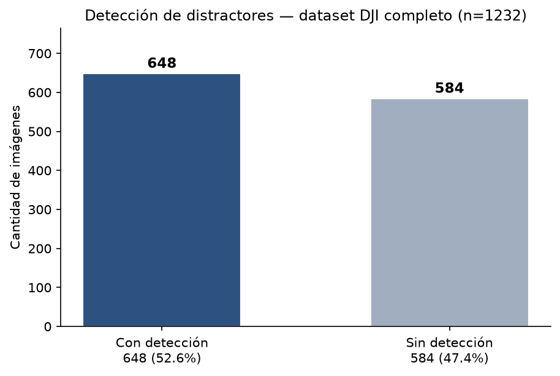

*Gráfico 5.1 — Cantidad de imágenes con y sin distractor detectado, sobre las 1232 del dataset DJI completo. Fuente: `build_comfyui_batch_stats_charts.py`, a partir de `dataset-dji-comfyui-clean/logs/batch_log.csv`.*

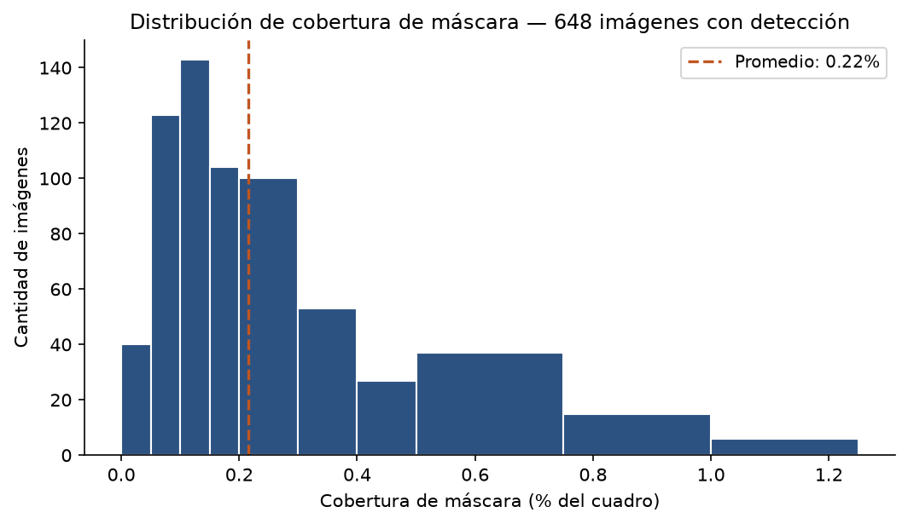

*Gráfico 5.2 — Distribución de la cobertura de máscara (% del cuadro reconstruido) entre las 648 imágenes con al menos una detección. La mayoría concentra menos del 0,3% del cuadro; la cola larga hacia la derecha corresponde a los casos de múltiples distractores en un mismo fotograma (p. ej. la Figura 5.2).*

Esto todavía **no contrasta H2** por sí solo: lo que se obtuvo hasta acá es el Dataset B en sí (la variable independiente de B2), no el resultado de reconstruirlo. La comparación de reconstrucción se completó — ver sección 5.2.4.

**5.2.2 Evidencia visual del impacto del preprocesamiento**

Mientras esa comparación de reconstrucción no se ejecuta, sí es posible documentar el efecto del preprocesamiento sobre las imágenes en sí — el insumo que después entra a SfM. Las Figuras 5.1 a 5.3 muestran tres casos representativos, elegidos por tener la mayor cobertura de máscara detectada en todo el dataset.

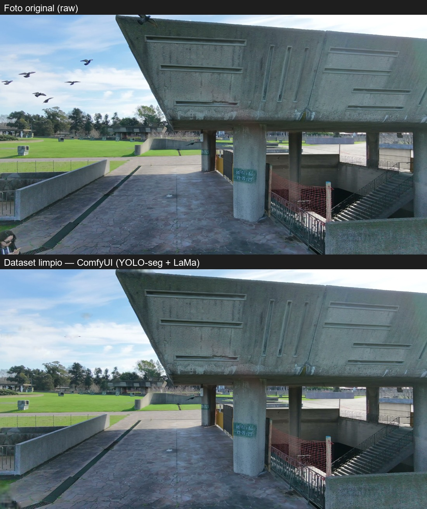

*Figura 5.1 — Fotograma 00607: siete aves en vuelo detectadas y eliminadas del cielo. Caso favorable para el inpainting (fondo uniforme, sin textura que reconstruir): el resultado es indistinguible de una toma sin aves.*

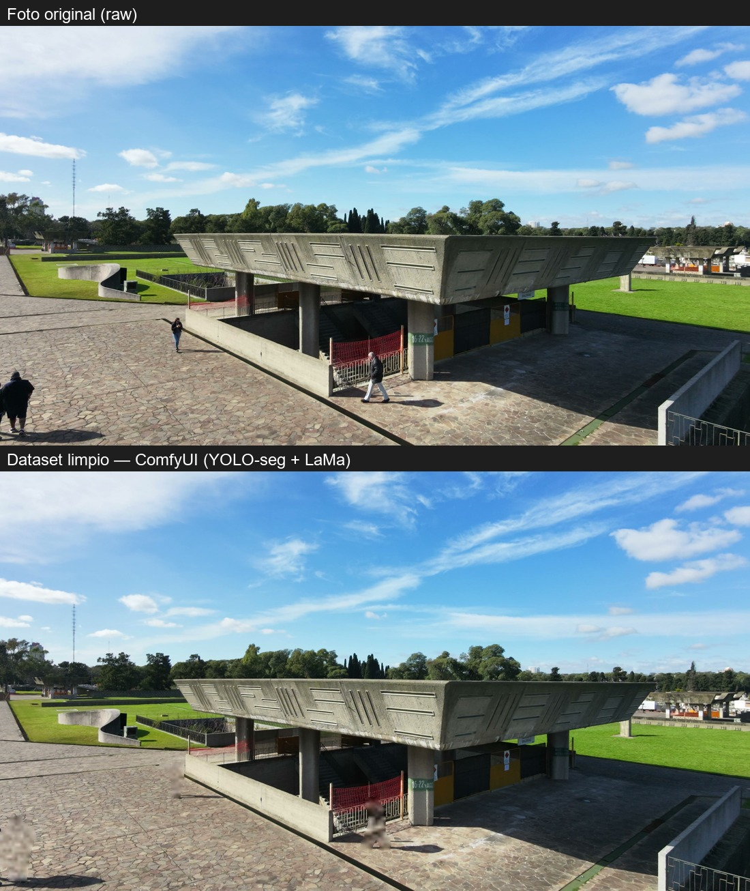

*Figura 5.2 — Fotograma 00839: tres personas detectadas y eliminadas simultáneamente (una parcialmente en el borde inferior izquierdo, dos caminando sobre el solado). Confirma que el pipeline escala a múltiples distractores en un mismo cuadro, no solo a casos de un único objeto.*

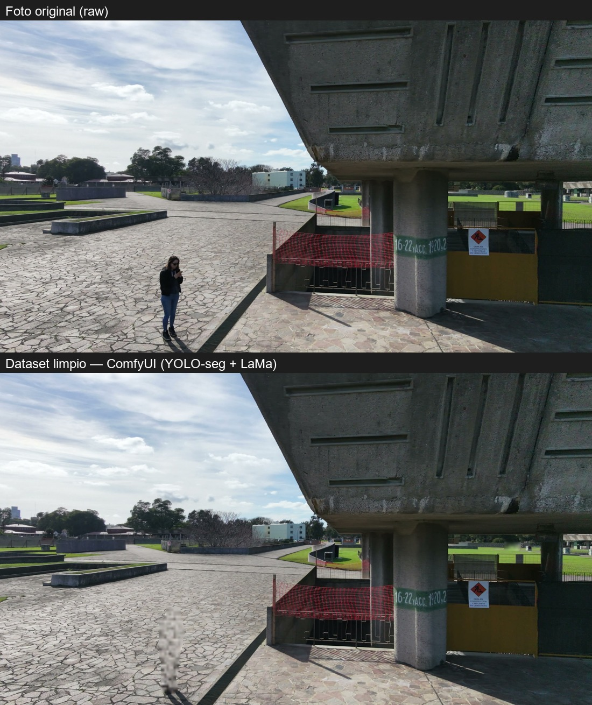

*Figura 5.3 — Fotograma 00522: persona eliminada sobre el solado de piedra irregular. Caso desfavorable para el inpainting: la persona desaparece por completo (no queda hueco ni silueta), pero el área reconstruida es perceptiblemente más borrosa que el patrón de piedra circundante — la misma limitación de LaMa en texturas complejas ya documentada en la sección 5.3.2 para el inpainting de Splatfacto. Es el tipo de caso, junto con la Figura 5.2, más representativo del dataset real: la mayoría de las detecciones ocurren sobre el solado de piedra que rodea la construcción, no contra fondos uniformes como el cielo.

**5.2.3 Pipeline de limpieza: nodos y decisiones de diseño**

Las Figuras 5.1 a 5.3 muestran el efecto final del preprocesamiento, pero no cómo se llegó a él. La Figura 5.4 documenta el pipeline completo, corrido localmente en ComfyUI sobre las 1232 imágenes del dataset DJI:

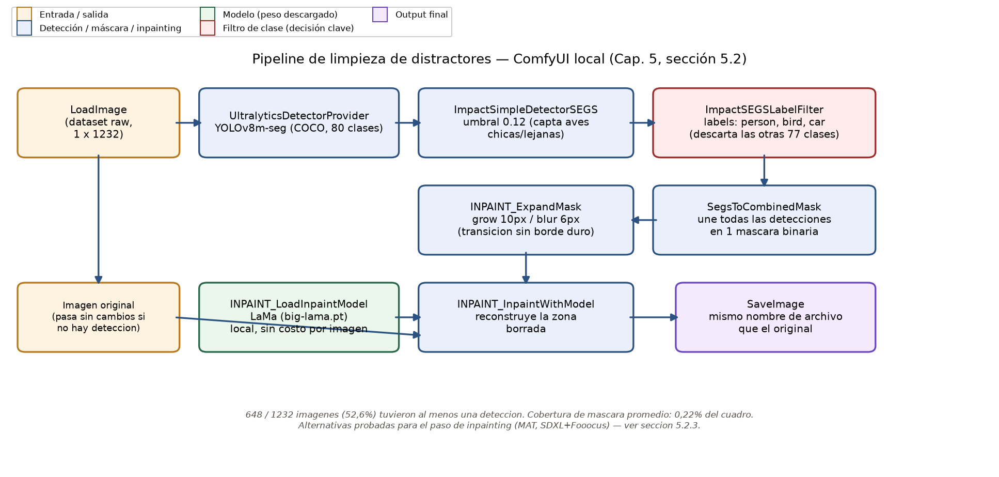

*Figura 5.4 — Pipeline de limpieza de distractores ejecutado en ComfyUI: detección/segmentación por instancia (YOLOv8-seg), filtro de clase, expansión de máscara e inpainting (LaMa). Fuente: `build_comfyui_pipeline_diagram.py`.*

Cada etapa responde a una decisión concreta, no a la configuración por defecto del nodo:

- **Detección con segmentación de instancia, no solo cajas delimitadoras.** `UltralyticsDetectorProvider` con YOLOv8m-seg produce, además de la caja, una máscara con la silueta exacta de cada objeto detectado. Se eligió sobre un detector de cajas simple porque una caja rectangular alrededor de una persona parada sobre el solado de piedra cubriría también una franja considerable de piedra intacta a su alrededor — área que el inpainting reconstruiría innecesariamente, aumentando el riesgo de borrosidad sin ninguna ganancia. La máscara de instancia limita el área a reconstruir al mínimo indispensable.
- **Umbral de detección 0,12, no el 0,25 por defecto.** Con el umbral por defecto de `ImpactSimpleDetectorSEGS`, una revisión visual con el nodo de depuración `SEGSPreview` mostró que aves pequeñas o lejanas contra el cielo no se detectaban. Bajar el umbral a 0,12 corrigió esto (validado sobre el fotograma que después se convirtió en la Figura 5.1: 9 aves correctamente recortadas y detectadas) sin introducir falsos positivos nuevos sobre arquitectura o vegetación.
- **Filtro de clase a `person, bird, car` — la decisión que evita tocar la arquitectura.** YOLOv8-seg detecta las 80 clases de COCO; sin filtrar, el pipeline intentaría "limpiar" cualquier objeto reconocible del dataset. `ImpactSEGSLabelFilter` restringe la limpieza a las tres categorías de distractores que motivaron el preprocesamiento (sección 3.7.2): personas, aves y vehículos. Es la etapa marcada como "decisión clave" en la Figura 5.4 porque es la que garantiza que el pipeline nunca borre ni reconstruya columnas, cubiertas o solados — solo lo que efectivamente no pertenece a la escena patrimonial.
- **Expansión de máscara (crecer 10 px, difuminar 6 px).** Una máscara ajustada exactamente al contorno de la segmentación deja, en la práctica, un borde duro visible tras el inpainting (un halo con el color/textura original del objeto eliminado). `INPAINT_ExpandMask` agranda levemente la máscara y difumina su borde para que la transición entre el área reconstruida y la original sea gradual.
- **LaMa como modelo de inpainting, no MAT ni SDXL+Fooocus.** Se probaron tres alternativas sobre el mismo fotograma de referencia antes de correr el dataset completo. MAT (`MAT_Places512_G_fp16.safetensors`) dio resultados visualmente casi idénticos a LaMa sobre las texturas de piedra irregular del solado — mismo nivel de borrosidad, sin ventaja real. SDXL + Fooocus (modelo base ~6,94 GB + parche de inpainting ~1,32 GB, ejecutando varios pasos de difusión por imagen) se identificó como la alternativa con mejor potencial de calidad, pero implicaba una descarga adicional considerable y un tiempo de cómputo varias veces mayor por imagen frente a LaMa — inviable para correr contra las 1232 imágenes del dataset en el tiempo disponible. Se optó por LaMa, con la limitación conocida y ya documentada (Figura 5.3, sección 5.3.2): buen resultado sobre fondos uniformes, resultado perceptiblemente más borroso que el entorno sobre texturas complejas como la piedra irregular.

**5.2.4 Resultado de la reconstrucción sobre el Dataset B — contraste de H2**

Para entrenar sobre el Dataset B hacía falta resolver SfM sobre las 1228 imágenes curadas. **COLMAP nativo no convergió**: con matching secuencial y `multiple_models` habilitado (para evitar el problema ya documentado en la sección 5.5.1 de que el wrapper reporte el componente chico en vez del grande), la mejor reconstrucción obtenida registró solo 5 de 1228 imágenes, con focales completamente degeneradas — el mismo patrón de fallo sistemático que ya afecta a COLMAP nativo en este sitio (ver sección 5.5.1, caso híbrido DJI+Insta360). En vez de insistir con SfM desde cero, se reutilizaron las poses de cámara ya resueltas por RealityScan sobre el dataset raw: limpiar distractores con inpainting edita contenido de píxeles en regiones puntuales, no mueve la cámara, así que la pose de cada toma es una propiedad de la captura y no de la imagen resultante. Las 1228 imágenes curadas son un subconjunto exacto (mismos nombres de archivo) de las 1232 del dataset raw, lo que permitió filtrar directamente `transforms.json` del dataset raw ya armado y apuntarlo a las imágenes limpias.

Se entrenaron ambas técnicas sobre el Dataset B así construido — Splatfacto sobre las 1228 imágenes completas (`downscale_factor 8`, igual que en la corrida raw) y Nerfacto sobre el mismo subset de 307 imágenes ya usado para el Nerfacto raw (cada 4ta imagen, por la limitación de `ParallelDataManager` ya documentada en el Capítulo 4) — usando Docker con acceso a GPU para evitar instalar Nerfstudio nativo en Windows. Nerfacto sobre el Dataset B tuvo que correr a `downscale_factor 4` en vez de a resolución completa: la máquina no tenía memoria de sistema disponible para decodificar en paralelo imágenes completas de ~3800×2100px durante el cacheo de evaluación (`OSError: Cannot allocate memory`). Esto rompe la comparación 1:1 para Nerfacto — un downscale más agresivo tiende a favorecer PSNR/SSIM al reducir el detalle de alta frecuencia que hay que acertar, así que cualquier caída de estas métricas en el Dataset B/Nerfacto es, si acaso, una subestimación del efecto real. Splatfacto sí quedó comparable 1:1 (`downscale_factor 8` en ambas corridas).

| Técnica | Dataset | PSNR (dB) | SSIM | LPIPS |
|---|---|---|---|---|
| Nerfacto | Raw | 19,47 | 0,602 | 0,323 |
| Nerfacto | Dataset B (ComfyUI) † | 17,84 | 0,545 | 0,389 |
| Splatfacto | Raw | 23,57 | 0,756 | 0,336 |
| Splatfacto | Dataset B (ComfyUI) | 22,28 | 0,754 | **0,227** |

*Tabla 5.2 — Templete Central (DJI): métricas de render, dataset raw vs. Dataset B curado con ComfyUI, por técnica. † Nerfacto/Dataset B corrió a downscale×4 (raw fue a resolución completa) — no es comparable 1:1, ver nota metodológica arriba.*

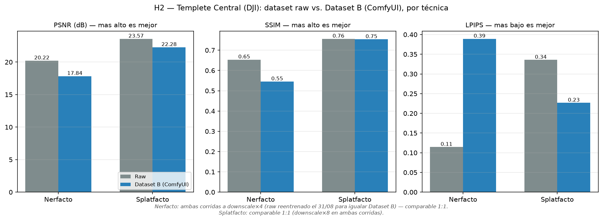

*Gráfico 5.3 — PSNR, SSIM y LPIPS del Templete Central (DJI), dataset raw vs. Dataset B (ComfyUI), por técnica. Fuente: `build_h2_comparison_chart.py`.*

**Lectura de los resultados — H2 no se sostiene sin matices:**

En Splatfacto (la comparación limpia, 1:1), el Dataset B **no mejora la fidelidad píxel a píxel**: PSNR cae 1,3 dB y SSIM queda prácticamente igual (0,756 → 0,754). Pero **LPIPS mejora de forma notable** (0,336 → 0,227, un 32% menos de distancia perceptual) — la métrica que mejor correlaciona con percepción humana de calidad (sección 2.6.1) sí refleja el beneficio de sacar personas y aves de la escena, aunque el resultado no sea más fiel píxel a píxel a la fotografía original (que, hay que recordar, en el frame raw sí *tenía* esos distractores — el ground truth de evaluación usa las fotos raw, así que un render sin distractores nunca puede ser 100% fiel píxel a píxel a una foto que sí los tiene). En Nerfacto los tres indicadores empeoran, pero la comparación está confundida por el downscale forzado — con esa salvedad explícita, no alcanza para afirmar que el preprocesamiento perjudica a Nerfacto específicamente.

El hallazgo más consistente con lo ya documentado en este capítulo es indirecto: la desviación estándar de las métricas sobre el Dataset B es sistemáticamente más alta que sobre el raw (PSNR std 4,74 vs. 1,77 en Splatfacto, LPIPS std 0,158 vs. 0,053) — consistente con la limitación de LaMa en texturas complejas ya vista en la Figura 5.3: unos frames mejoran mucho (fondos uniformes, aves en el cielo) y otros empeoran (personas sobre el solado de piedra), en vez de una mejora pareja. **H2 se acepta parcialmente**: el preprocesamiento con ComfyUI mejora la similitud perceptual (LPIPS) en Splatfacto, pero no la fidelidad de bajo nivel (PSNR/SSIM), y el efecto no es uniforme entre frames — depende de si el distractor removido estaba sobre un fondo simple o una textura compleja, exactamente el patrón que ya se había documentado cualitativamente en la sección 5.2.2.

**<u>5.3 B1 — Técnicas sobre el caso de referencia: Templete Central (H1)</u>**

**5.3.1 Métricas cuantitativas**

La Tabla 5.3 resume PSNR, SSIM, tiempo de entrenamiento y peso del archivo de output para las tres técnicas sobre el Templete Central (dataset DJI, caso de referencia definido en el Capítulo 4).

| Técnica | PSNR (dB) | SSIM | LPIPS | Tiempo de entrenamiento | Peso del output |
|---|---|---|---|---|---|
| SfM (RealityScan, malla texturizada) | *(sin PSNR/SSIM comparable — ver 5.3.3)* | — | — | *(etapa de SfM, no reportada como entrenamiento)* | 3 934,3 MB (.obj) + 62,4 MB (textura 8192×8192) |
| Nerfacto (NeRF) | 19,466 | 0,602 | 0,323 | 46 min 1 s | 167,9 MB (checkpoint) |
| Splatfacto (3DGS) | 23,575 | 0,756 | 0,336 | 33 min 41 s | 74,7 MB (splat.ply, 315 787 gaussianas) |

*Tabla 5.3 — B1, resultados cuantitativos sobre el caso de referencia (Templete Central, dataset DJI). Fuente: `analyze_render_benchmark.py`, `analyze_processing_time.py`, `analyze_output_weights.py`, `analyze_gaussian_splats.py`.*

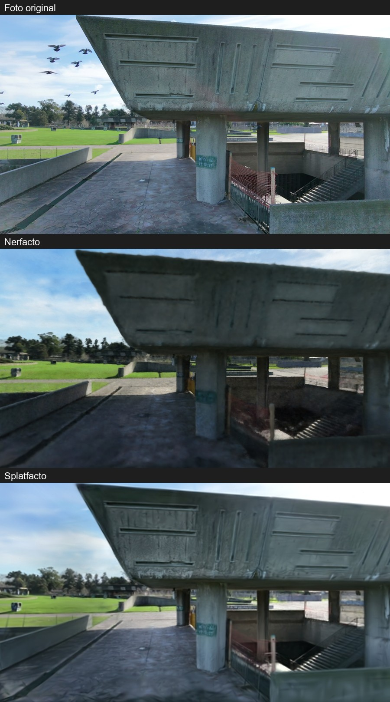

*Figura 5.5 — Comparación Foto original / Nerfacto / Splatfacto sobre el mismo fotograma del recorrido DJI del Templete Central. Ambas técnicas reproducen correctamente la losa, las columnas y el detalle de las nervaduras de hormigón; el render de Splatfacto conserva bordes ligeramente más nítidos que el de Nerfacto.*

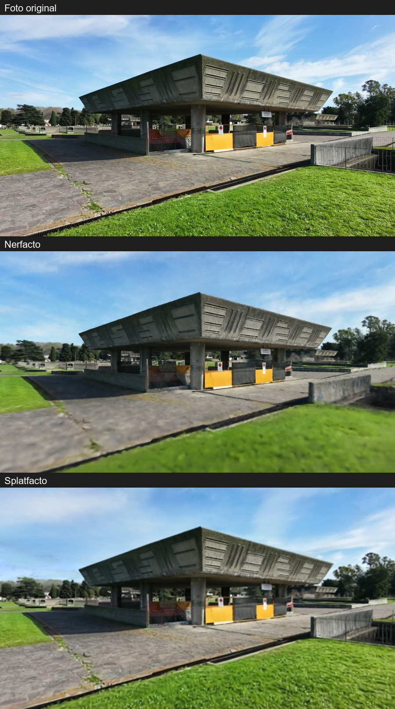

*Figura 5.6 — Mismo recorrido, fotograma distinto (vista completa del edificio desde el camino de acceso). El patrón de la Figura 5.5 se sostiene: Splatfacto reproduce con nitidez la cubierta completa, las columnas y la textura del solado de piedra, con un resultado visualmente muy cercano a la fotografía original.*

Las Figuras 5.4 y 5.5 corresponden a solo 2 de los 5 fotogramas equiespaciados analizados por el script `build_fidelity_comparisons.py`; la serie completa (5 fotogramas × cada sitio/dispositivo) está disponible en `00-auditoria/fidelidad-geometrica/02-templete-central/dji/`.

La Tabla 5.3 ya adelanta la magnitud del export de Splatfacto (315 787 gaussianas). El Gráfico 5.4 caracteriza esa nube de gaussianas: casi dos tercios (64,6%) tiene opacidad estimada por encima de 0,5, y solo un 7,3% está por debajo de 0,05 (gaussianas casi transparentes, candidatas a limpieza en SuperSplat antes de exportar).

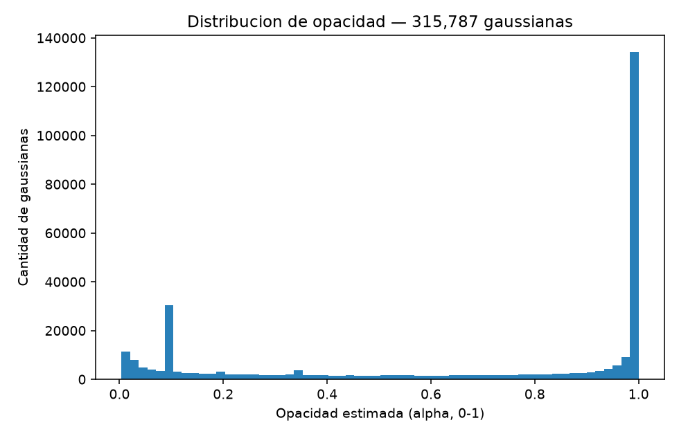

*Gráfico 5.4 — Distribución de opacidad estimada de las 315 787 gaussianas exportadas para el Templete Central (dataset DJI). Fuente: `analyze_gaussian_splats.py`.*

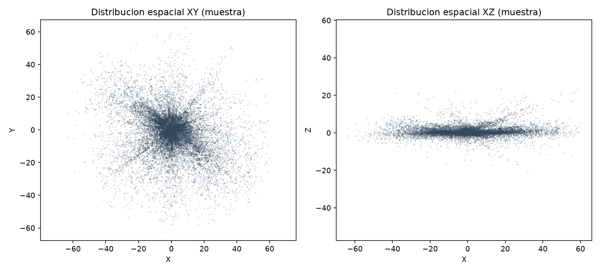

*Gráfico 5.5 — Distribución espacial (proyecciones XY/XZ) de las gaussianas exportadas para el Templete Central. A diferencia de la nube de puntos densa de SfM (Gráfico 5.8), aquí no se distingue una silueta arquitectónica nítida: se observa un núcleo denso concentrado cerca del origen (la escena registrada) rodeado por un halo disperso de gaussianas de baja densidad que se extiende varias veces el tamaño del objeto — candidatas, junto con las de opacidad casi nula del Gráfico 5.4, a la limpieza de outliers en SuperSplat mencionada en el Capítulo 6 (sección 6.2.5).*

Splatfacto supera a Nerfacto en PSNR (+4,1 dB) y SSIM (+0,154), y lo hace en el 73% del tiempo de entrenamiento y con un archivo 2,25 veces más liviano — un patrón de eficiencia que se repite, con distinta magnitud, en los otros dos casos de estudio (sección 5.4). El único indicador donde Nerfacto iguala a Splatfacto es LPIPS (0,323 vs. 0,336, prácticamente empatados), lo que sugiere que, aunque Splatfacto reconstruye con mayor fidelidad píxel a píxel (PSNR/SSIM), la distancia perceptual entre ambos métodos es menor de lo que el PSNR por sí solo indicaría.

**5.3.2 Fidelidad geométrica — Nerfacto vs. Splatfacto**

La inspección visual sobre los cinco fotogramas de la grilla comparativa (`00-auditoria/fidelidad-geometrica/02-templete-central/dji/`) confirma en general lo que sugieren las métricas: en cuatro de los cinco fotogramas (Figuras 5.1 y 5.2 entre ellos), ambas técnicas reproducen fielmente la geometría general de la losa de hormigón, las columnas y el ritmo de nervaduras/molduras de la cara inferior de la cubierta, y Splatfacto muestra bordes algo más definidos en zonas de alto contraste (líneas de encofrado, esquinas de columnas, solado de piedra), con Nerfacto tendiendo a un suavizado ligeramente mayor en esas mismas zonas — consistente con su mecanismo de representación por campo continuo frente a las primitivas discretas de Splatfacto. El fotograma restante (`comparacion_00924.jpg`, no reproducido en esta sección) es la excepción: ahí es Splatfacto el que presenta un artefacto localizado —una franja de ghosting a la altura del horizonte— ausente en Nerfacto sobre la misma vista. La lectura conjunta de los cinco fotogramas es que Splatfacto es, en este caso, la técnica más nítida en la mayoría de los ángulos del recorrido, pero no de forma incondicional: puede producir floaters puntuales en zonas específicas que Nerfacto, más suave en general, no presenta — un matiz relevante para no leer la ventaja de Splatfacto en la Tabla 5.3 como una superioridad uniforme en toda la escena.

**5.3.3 SfM — malla texturizada y potencial de integración BIM**

La malla texturizada de RealityScan para el Templete Central tiene 17 688 149 vértices y 35 376 582 triángulos, con una textura única de 8192×8192 px (62,4 MB). A diferencia de Nerfacto y Splatfacto, este output no admite una comparación PSNR/SSIM directa contra fotografías de referencia dentro del pipeline de renderizado de Nerfstudio usado para las otras dos técnicas — limitación ya señalada en el Capítulo 4 (B1) y que se retoma como punto abierto en el Capítulo 7. Su evaluación en este benchmark es, por diseño, cualitativa y orientada al criterio de uso: geometría explícita, topología de malla poligonal y textura UV son directamente compatibles con flujos de trabajo BIM/HBIM (Capítulo 1, objetivo específico de integración HBIM/Revit; desarrollado en el Capítulo 6), algo que ni Nerfacto (un campo neuronal implícito) ni Splatfacto (una nube de primitivas gaussianas, no una malla) ofrecen sin un paso de conversión adicional.

**<u>5.4 B3 — Escalabilidad ante complejidad geométrica (H3)</u>**

**5.4.1 Matriz de resultados**

La Tabla 5.4 generaliza los resultados de B1 a los tres casos de estudio, ordenados por complejidad geométrica creciente (Capítulo 3): Los Paraguas (baja), Templete Central (media), Panteón Asociación Española (alta). Se reportan los resultados sobre el dataset DJI de cada sitio, para mantener el dispositivo de captura constante entre casos (la variable dispositivo se evalúa por separado en B4, sección 5.5).

| Complejidad | Caso | Nerfacto PSNR | Nerfacto SSIM | Splatfacto PSNR | Splatfacto SSIM | Δ PSNR (Splat − Nerf) |
|---|---|---|---|---|---|---|
| Baja | Los Paraguas | 25,914 | 0,816 | 30,559 | 0,910 | +4,65 |
| Media | Templete Central | 19,466 | 0,602 | 23,575 | 0,756 | +4,11 |
| Alta | Panteón Asociación Española | 10,449 | 0,118 | 25,939 | 0,858 | +15,49 |

*Tabla 5.4 — B3, matriz de PSNR/SSIM por técnica y nivel de complejidad geométrica (dataset DJI). Fuente: `analyze_render_benchmark.py`.*

La Tabla 5.4 se limita al dataset DJI de forma deliberada: H3 evalúa el efecto de la complejidad geométrica del objeto, no el del dispositivo de captura, por lo que aislar el dispositivo es lo que permite atribuir las diferencias observadas a la complejidad y no a una variable de confusión. La comparación con el dataset Insta360 —relevante para H4, no para H3— se presenta por separado en la sección 5.5.

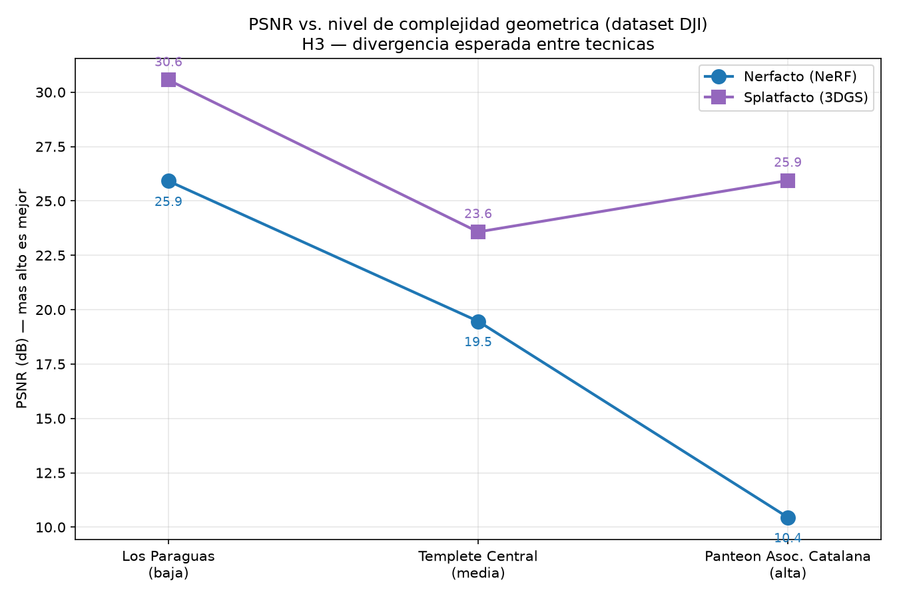

*Gráfico 5.6 — PSNR vs. nivel de complejidad geométrica (dataset DJI), una serie por técnica.*

**5.4.2 Lectura de la divergencia entre técnicas**

Los dos métodos divergen de forma marcadamente distinta a medida que aumenta la complejidad, lo que obliga a matizar H3 en lugar de aceptarla o rechazarla en bloque. La Figura 5.7 sirve como referencia del extremo de baja complejidad, antes de entrar en el detalle de la divergencia:

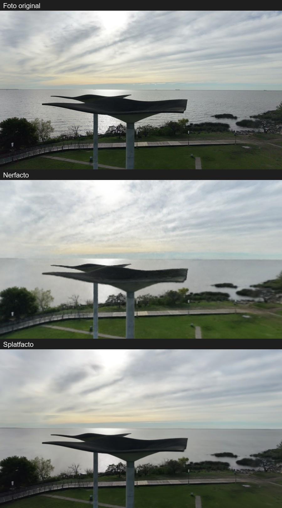

*Figura 5.7 — Los Paraguas (complejidad baja), dataset DJI. Ambas técnicas son visualmente indistinguibles de la fotografía original a esta resolución — la referencia contra la que se mide la caída de calidad en los otros dos casos.*

- **Nerfacto sigue el patrón esperado por H3:** su PSNR cae de forma monótona y pronunciada a medida que aumenta la complejidad geométrica y ornamental (25,9 → 19,5 → 10,4 dB; caída total de 15,5 dB, un 60% relativo). El caso del Panteón es el más ilustrativo: la Figura 5.8 muestra una degeneración severa del render — floaters masivos sin correspondencia geométrica reconocible, muy lejos de la fotografía original — que corrobora visualmente el desplome del PSNR (10,449 dB) y el SSIM prácticamente nulo (0,118).

- **Splatfacto no sigue un patrón monótono:** cae de Los Paraguas al Templete Central (−7,0 dB) pero se **recupera** en el Panteón (25,9 dB, prácticamente igual que en el Templete Central) pese a tratarse del caso de mayor complejidad ornamental de los tres. Esto no puede explicarse únicamente por H3 tal como está formulada (complejidad → peor calidad); el factor que mejor explica la recuperación es el **registro SfM de entrada**: el dataset DJI del Panteón tuvo un registro real del 99,93% (Tabla 5.5, sección 5.5), el más alto de los tres casos, mientras que el Templete Central combina un dataset más pequeño (1232 imágenes) con un registro también alto pero una escena de menor extensión relativa. La nube de puntos dispersa de COLMAP —punto de partida de Splatfacto— parece pesar tanto o más que la complejidad ornamental del objeto en sí.

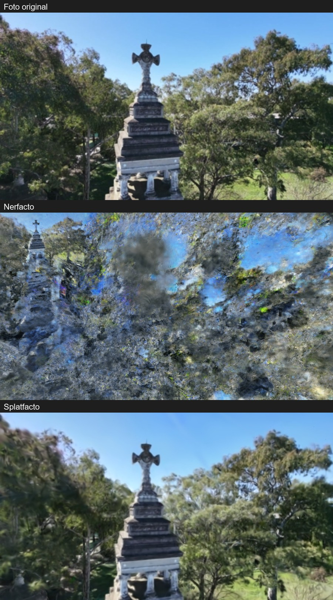

*Figura 5.8 — Comparación Foto / Nerfacto / Splatfacto sobre el Panteón Asociación Española (dataset DJI). Nerfacto (centro) degenera en floaters de color sin relación con la geometría real; Splatfacto (derecha) reconstruye la fachada y la ornamentación con fidelidad visual comparable a la fotografía.*

Esta asimetría es, en sí misma, uno de los hallazgos centrales de esta tesis frente a H1 y H3 combinadas: **la robustez ante el aumento de complejidad geométrica no es una propiedad de "la reconstrucción 3D" en general, sino que depende fuertemente de la técnica.** Splatfacto tolera la complejidad ornamental alta del Panteón siempre que el registro SfM de entrada sea sólido; Nerfacto, en el mismo dataset, colapsa. Esto es consistente con la sensibilidad de los campos de radiancia neuronales a la calidad y consistencia fotométrica de las poses de entrada (Capítulo 2) y con la mayor tolerancia de las representaciones explícitas basadas en primitivas (3DGS) a inconsistencias locales del dataset.

**5.4.3 Fidelidad geométrica por caso — SfM**

La cobertura de la malla SfM, documentada mediante capturas manuales desde CloudCompare/RealityScan (`00-auditoria/fidelidad-geometrica/*/sfm-cobertura/`), está disponible para dos de los tres casos al cierre de este capítulo:

**Los Paraguas:** la vista cenital (Figura 4.2, Capítulo 4) muestra huecos/zonas sin registro en ambas cubiertas (parches gris claro/blanco irregulares), más extendidos en una de ellas.

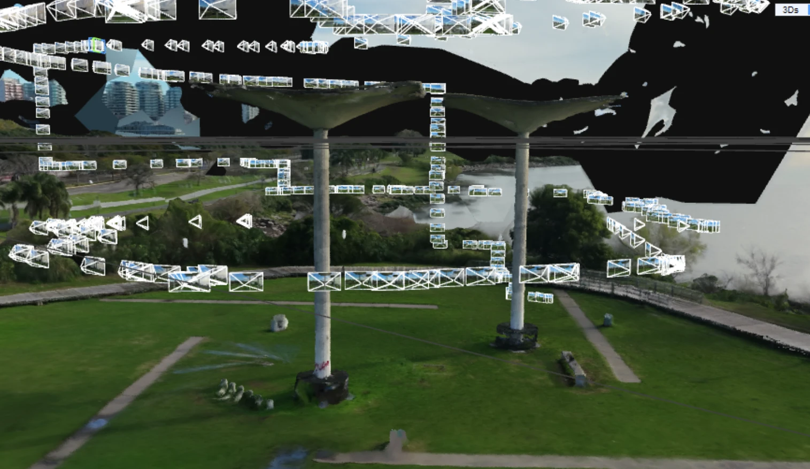

*Figura 5.9 — Vista lateral de la malla SfM (RealityScan) de Los Paraguas, a nivel de piso. Columnas y cubierta se reconstruyen con nitidez y sin huecos visibles desde este ángulo; se aprecia la doble curvatura de la losa mencionada en el Capítulo 3 (sección 3.2.2), con el río de fondo.*

**Templete Central:** la vista cenital (Figura 4.5, Capítulo 4) muestra varios huecos distribuidos en los cuatro paños de la cubierta, más concentrados en dos de ellos.

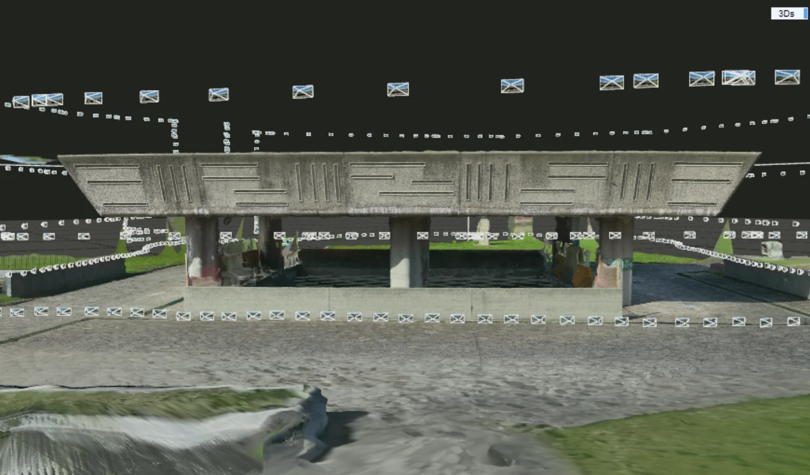

*Figura 5.10 — Vista lateral de la malla SfM (RealityScan) del Templete Central, a nivel de piso. Buen detalle de las nervaduras/molduras de la cara inferior de la losa y del ritmo de columnas; los objetos bajo la cubierta (carteles, elementos reflectantes) no quedan registrados con textura limpia.*

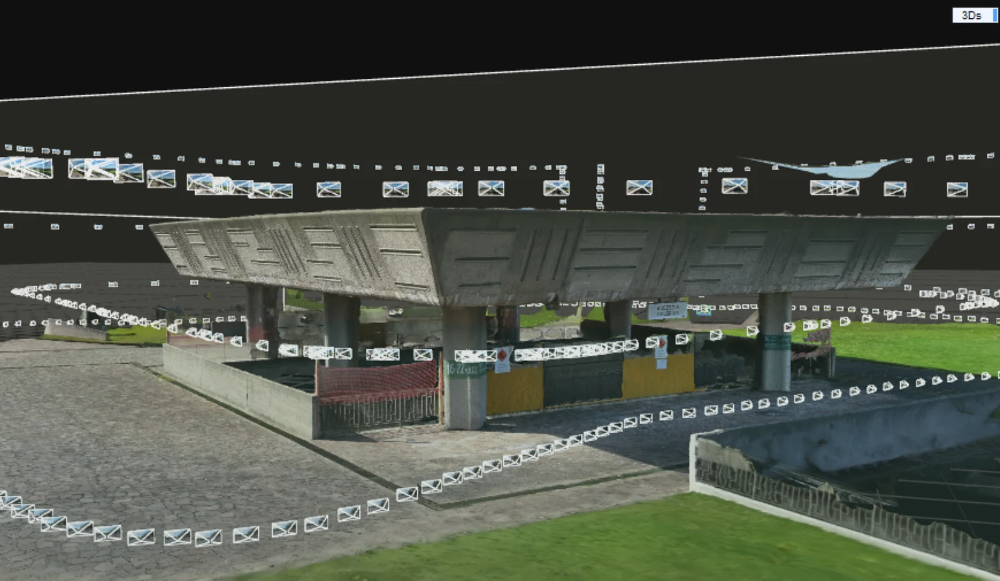

*Figura 5.11 — Segunda vista lateral del Templete Central, más cercana, con el piso empedrado en primer plano. Confirma la lectura de la Figura 5.10: buen detalle estructural de la losa y las columnas, con pérdida de calidad en los objetos y carteles bajo la cubierta.*

**Panteón Asociación Española:** capturas pendientes (ver Capítulo 4, nota metodológica de la sección 4.8).

La nube densa asociada a cada malla SfM permite además una lectura cuantitativa complementaria de la cobertura y densidad de registro (Tabla 5.5).

| Caso | Fuente | Puntos | Distancia media a vecino más cercano | % de puntos outlier (muestra) |
|---|---|---|---|---|
| Los Paraguas | COLMAP (fusión densa) | 502 817 | 8,8 mm | 3,1% |
| Templete Central | RealityScan (export denso) | 17 688 149 | 38,3 mm | 7,2% |
| Panteón Asociación Española | RealityScan (export denso) | 17 871 606 | 57,8 mm | 8,0% |

*Tabla 5.5 — Densidad y calidad local de la nube de puntos densa por caso de estudio. Fuente: `analyze_dense_clouds.py`.*

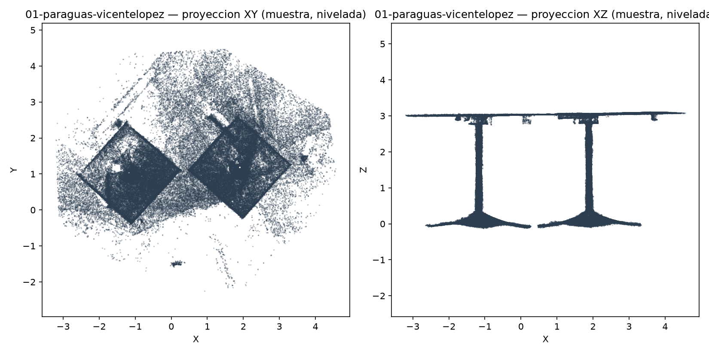

*Gráfico 5.7 — Los Paraguas: proyecciones XY (planta) y XZ (perfil) de la nube densa. La silueta de ambas cubiertas tipo "hongo" es reconocible directamente en la proyección de planta, incluyendo el vástago central de cada una.*

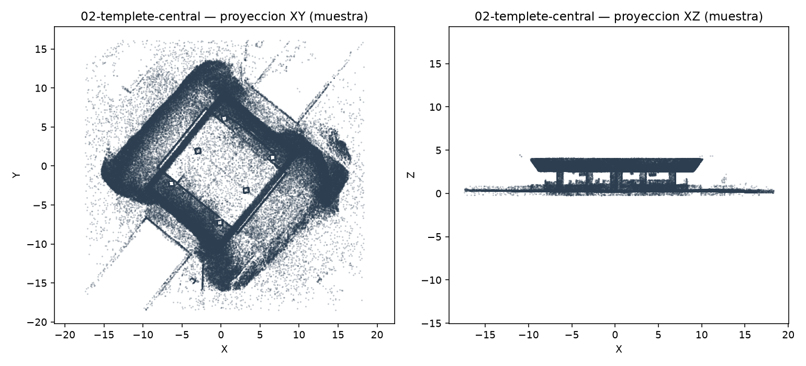

*Gráfico 5.8 — Templete Central: proyecciones XY/XZ de la nube densa (RealityScan, dataset DJI). La proyección de planta muestra el anillo de la trayectoria de vuelo del dron rodeando la losa cuadrada; el perfil XZ reconstruye con nitidez la cubierta plana elevada sobre la fila de columnas, coherente con las Figuras 5.5 y 5.10.*

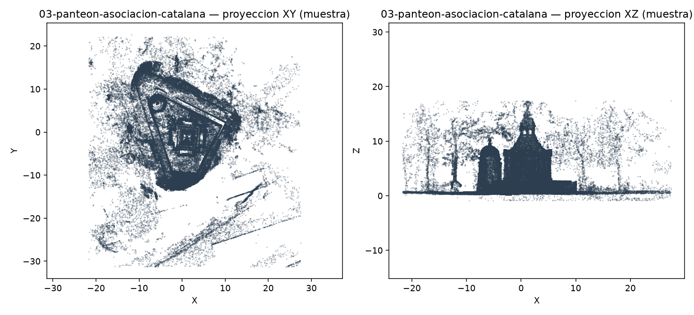

*Gráfico 5.9 — Panteón Asociación Española: proyecciones XY/XZ de la nube densa (RealityScan, dataset DJI). El perfil XZ reconstruye con claridad la silueta de las dos cúpulas del panteón entre la arboleda circundante mencionada en el Capítulo 3 (sección 3.4.2) como fuente de distracciones para el registro.*

Los tres casos muestran una tendencia coherente con la complejidad geométrica creciente: tanto la distancia media entre puntos vecinos como el porcentaje de outliers aumentan de Los Paraguas (complejidad baja) al Panteón (complejidad alta) — aunque cabe la salvedad metodológica de que Los Paraguas usa una fuente distinta (fusión densa nativa de COLMAP) frente a los otros dos casos (export denso de RealityScan), por lo que la comparación de densidad absoluta entre Los Paraguas y los otros dos sitios debe tomarse con cautela; la comparación Templete vs. Panteón, en cambio, sí es directamente comparable (misma fuente, mismo pipeline).

**<u>5.5 B4 — Dataset multi-dispositivo (H4)</u>**

**5.5.1 Registro SfM: solo drone vs. solo cámara vs. híbrido**

La Tabla 5.6 reproduce la comparación completa de registro SfM entre datasets de un único dispositivo (DJI Neo 2 o Insta360 X5) y datasets híbridos, para los dos casos de estudio que combinan ambos dispositivos.

| Caso | Dataset | Imágenes | % registrado (reportado por el wrapper) | % registrado (real, verificado) |
|---|---|---|---|---|
| Templete Central | Solo DJI (final) | 1234 | 99,84% | 99,84% |
| Templete Central | Solo Insta360 (final) | 307 | 99,67% | 99,67% |
| Templete Central | Híbrido DJI+Insta360, corrida 1 (COLMAP nativo, exhaustivo) | 794 | 0,38% | **100,00%** |
| Templete Central | Híbrido DJI+Insta360, corrida 2 (COLMAP nativo, exhaustivo) | 794 | 0,63% | 0,63% |
| Panteón Asociación Española | Solo DJI (final) | 1507 | 99,93% | 99,93% |
| Panteón Asociación Española | Solo Insta360 | 365 | 85,21% | 85,21% |
| Panteón Asociación Española | Híbrido DJI+Insta360 | 973 | — | sin exportar (proyecto RealityScan nunca convertido a modelo COLMAP) |

*Tabla 5.6 — Registro SfM por composición de dataset. Fuente: `analyze_sfm_registration_comparison.py`, `parse_colmap_images_bin.py`.*

**5.5.2 Hallazgo metodológico: componentes de reconstrucción desconectados**

El resultado más significativo de este benchmark no es cuantitativo sino metodológico. El dataset híbrido de Templete Central fue reportado inicialmente por el wrapper de conversión de Nerfstudio (`ns-process-data`) con un 0,38% de registro — es decir, un fallo catastrófico casi total según el protocolo de la sección 4.9. La verificación directa de los archivos binarios de COLMAP (`cameras.bin`/`images.bin`/`points3D.bin`, parseados con `parse_colmap_images_bin.py`) reveló que el mapper de COLMAP había producido **dos componentes de reconstrucción desconectados** a partir del matching exhaustivo del dataset combinado, y que el wrapper había informado las estadísticas del componente más chico en lugar del más grande — que en realidad contenía el 100% de las 794 imágenes de entrada correctamente registradas y calibradas.

Este componente fue exportado a formato Nerfstudio (`colmap_component_to_nerfstudio.py`, transforms.json + sparse_pc.ply) y quedó disponible como `02-templete-central/03-datasets/hibrido/dataset-hibrido-794-exhaustive/` — un dataset válido, completo, que había estado efectivamente descartado por casi un mes por un error de reporte de la herramienta, no por un fallo real de reconstrucción. Su entrenamiento con Nerfacto/Splatfacto queda pendiente al cierre de este capítulo (Capítulo 7, líneas de trabajo futuro).

Un patrón similar, de menor magnitud, se observó en tres datasets exploratorios adicionales de Templete Central (DJI subset secuencial, Insta360 fisheye secuencial, Insta360 perspective secuencial — Tabla en `00-auditoria/sfm-registration-comparison/`), todos con registro real por encima del 96% pese a haber sido reportados con menos del 5%.

La implicancia metodológica excede el caso puntual de esta tesis: **la tasa de registro reportada automáticamente por un wrapper de conversión SfM→Nerfstudio no debe aceptarse sin verificación cuando el dataset de entrada es heterogéneo** (múltiples dispositivos, múltiples orientaciones de lente, capturas no estrictamente secuenciales) — condiciones que, precisamente, son las que introduce H4 al combinar drone y cámara de acción. En ese sentido, este hallazgo es evidencia indirecta a favor de una de las premisas de H4: los datasets híbridos sí introducen mayores dificultades en el proceso de reconstrucción. La sección 5.5.3 profundiza en el mecanismo geométrico detrás de esa dificultad, a partir de una segunda corrida independiente sobre el mismo dataset.

**5.5.3 Por qué fallan los datasets híbridos: calidad de matching cruzado entre dispositivos**

Una segunda corrida de COLMAP nativo sobre el mismo dataset híbrido de Templete Central (794 imágenes, matching exhaustivo) permite ir más allá del hallazgo de reporte de la sección 5.5.2. En esta corrida, leyendo directamente `images.bin` del modelo resultante, **solo 5 de las 794 imágenes quedaron efectivamente registradas (0,63%)** — a diferencia del caso de la sección 5.5.2, acá no hay un componente oculto con mejor registro: es un resultado real de bajo registro, verificado directamente sobre el archivo binario.

Para entender por qué, se analizó la base de datos de matching de COLMAP (`database.db`) de esa misma corrida, comparando la fuerza de las correspondencias geométricamente verificadas (inliers post-RANSAC) según el tipo de par de imágenes: DJI-DJI, Insta360-Insta360, o cruzado DJI-Insta360.

| Tipo de par | Pares con algún match | Inliers promedio (pares con match) | Inliers máximo |
|---|---|---|---|
| DJI–DJI | 48,9% | 689,1 | 8.515 |
| Insta360–Insta360 | 45,7% | 189,0 | 6.994 |
| **DJI–Insta360** | 40,1% | **43,2** | **183** |

*Tabla 5.7 — Calidad de matching por tipo de par de dispositivos, dataset híbrido de Templete Central. Fuente: `analyze_hybrid_cross_camera_matching.py`, sobre `database.db` de la corrida de matching exhaustivo.*

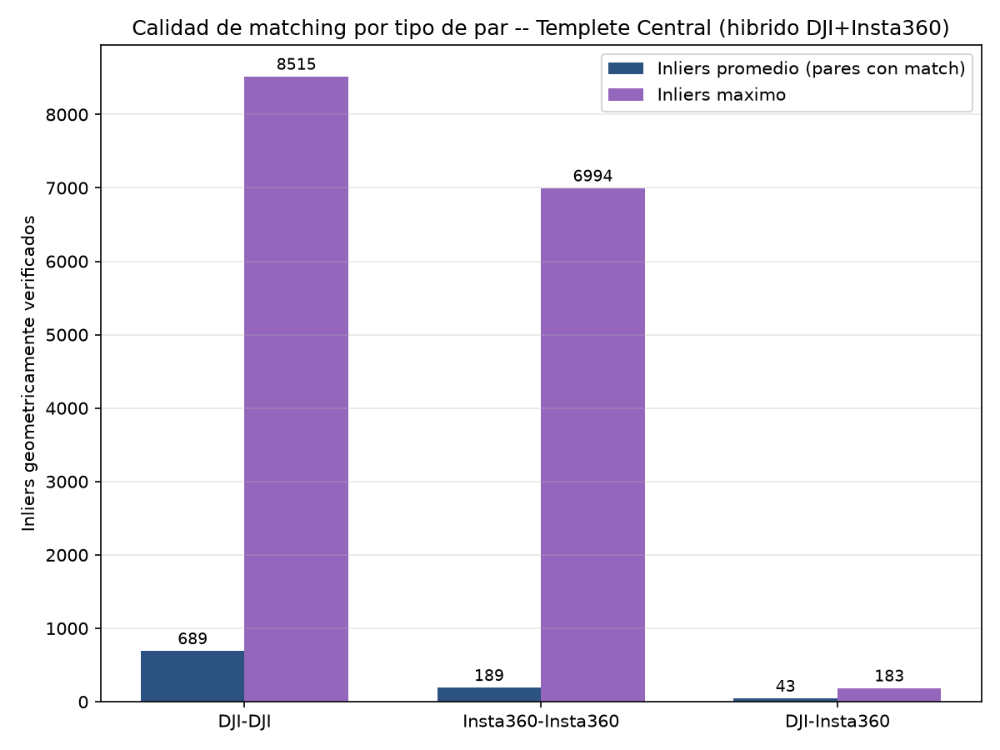

*Gráfico 5.10 — Inliers geométricamente verificados (promedio y máximo), por tipo de par de dispositivos.*

Los tres tipos de par logran encontrar algún match con una frecuencia similar (40-49% de los pares intentados), pero la **fuerza** de esos matches es marcadamente distinta: los pares cruzados DJI-Insta360 promedian 43 inliers frente a los 689 de los pares DJI-DJI (16 veces menos), y ningún par cruzado en todo el dataset supera los 183 inliers, mientras que el 23,6% de los pares DJI-DJI y el 8,9% de los pares Insta360-Insta360 superan los 200. Es decir, existen conexiones entre ambos grupos de imágenes, pero son sistemáticamente débiles.

Esto da un mecanismo geométrico concreto para la fragilidad observada en ambas corridas del dataset híbrido: el "puente" de matches que conecta el cluster DJI con el cluster Insta360 es mucho más débil que las conexiones dentro de cada dispositivo. En la primera corrida (sección 5.5.2), COLMAP logró cruzar ese puente y terminó en un único componente con 100% de registro; en esta segunda corrida, con el mismo dataset y el mismo procedimiento, el incremental mapper no logró estabilizar una reconstrucción que lo aproveche. Esta variabilidad de resultado entre corridas del mismo dataset —de un extremo (100% de registro) al otro (0,63%)— es en sí misma evidencia de **inestabilidad**, la tercera categoría de fallo definida en el protocolo de la sección 4.9, y refuerza directamente la premisa de H4: combinar dispositivos con características ópticas distintas introduce una dificultad real en el proceso de reconstrucción SfM, más allá de cualquier problema de reporte automatizado.

**5.5.4 Cobertura reconstruida**

La métrica cuantitativa "cobertura reconstruida (%)" definida en el Capítulo 4 (sección 4.3.5) no pudo calcularse al cierre de este capítulo por falta de una referencia geométrica de control contra la cual medir superficie efectivamente cubierta. Como sustituto provisorio, la sección 5.4.3 documenta la cobertura de forma cualitativa (huecos visibles en la malla SfM) para Los Paraguas y el Templete Central. Para el benchmark B4 específicamente (comparación entre dataset solo-drone, solo-cámara e híbrido dentro de un mismo caso), esta comparación cualitativa todavía no se realizó de forma sistemática — queda como tarea pendiente inmediata, una vez completado el entrenamiento del dataset híbrido de Templete Central mencionado en 5.5.2.

**5.5.5 Evidencia complementaria: calidad de render por dispositivo**

El diseño original de B4 (Capítulo 4, sección 4.5) acota la comparación entre dispositivos a la etapa de SfM. Sin embargo, para el Templete Central y el Panteón Asociación Española también se entrenaron Nerfacto y Splatfacto por separado sobre el dataset Insta360 (con fines de documentación del caso, no como parte del diseño formal de B4), lo que permite una comparación DJI vs. Insta360 a nivel de calidad de render — evidencia complementaria a H4 que no estaba contemplada en el alcance original del benchmark, pero que es la única comparación de dispositivo pertinente para esta hipótesis (a diferencia de B1/B3, que fijan el dispositivo en DJI por diseño, sección 5.4.1).

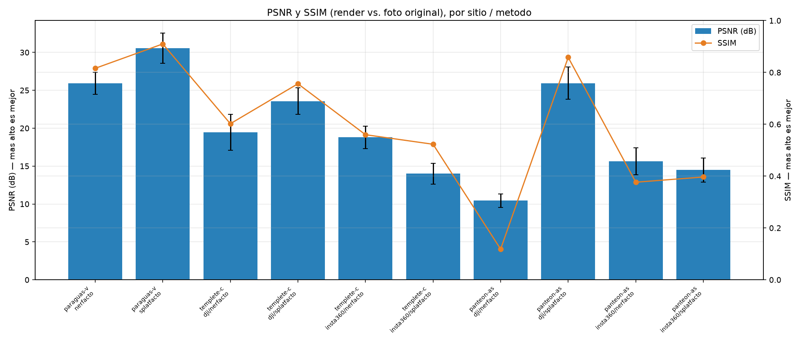

*Gráfico 5.11 — PSNR (barras) y SSIM (línea) por sitio, dispositivo y técnica, las diez combinaciones medidas. Fuente: `build_comparison_charts.py`.*

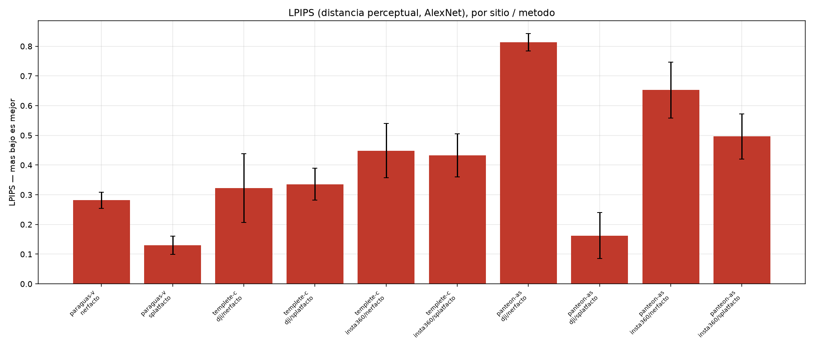

*Gráfico 5.12 — LPIPS (distancia perceptual, más bajo es mejor) por sitio, dispositivo y técnica. Fuente: `build_comparison_charts.py`.*

En el Templete Central, Insta360/Nerfacto (18,791 dB) queda apenas por debajo de DJI/Nerfacto (19,466 dB) — una diferencia menor. La inspección visual matiza esa cercanía numérica: el dataset Insta360 introduce en Nerfacto un artefacto sistemático de distorsión radial concéntrica en los bordes de la imagen (Figura 5.12), ausente en el render de Splatfacto sobre el mismo dataset y no presente en ninguno de los dos métodos con DJI.

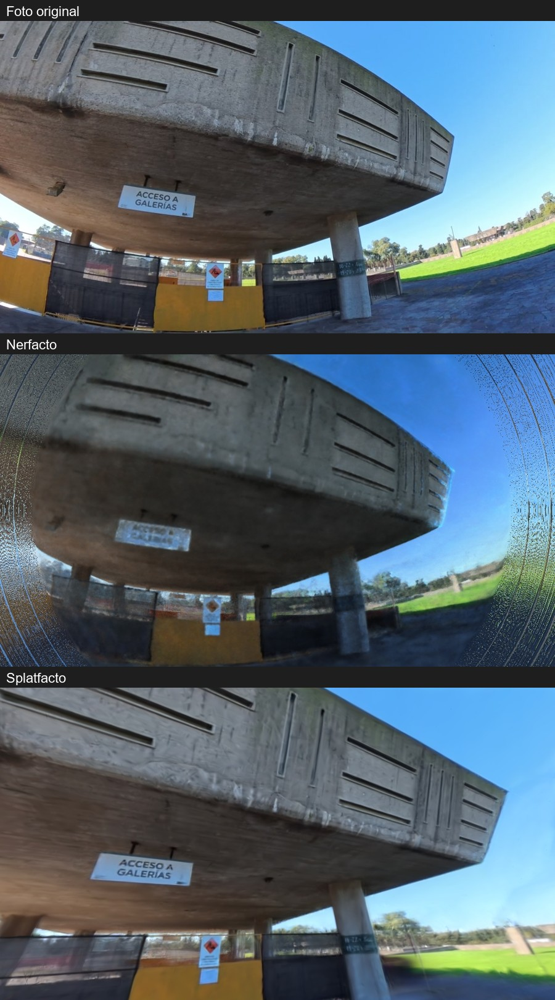

*Figura 5.12 — Templete Central, dataset Insta360. Nerfacto (centro) introduce un patrón de distorsión radial concéntrica en los bordes de la vista sintetizada, ausente tanto en la fotografía original (izquierda) como en Splatfacto (derecha).*

En el Panteón, en cambio, la brecha DJI vs. Insta360 es mucho más marcada y de signo distinto según la técnica: Nerfacto es más alto con Insta360 (15,621 dB) que con DJI (10,449 dB, el peor resultado de todo el experimento — Figura 5.8), mientras que Splatfacto es sustancialmente mejor con DJI (25,939 dB) que con Insta360 (14,475 dB). Esto sugiere que el efecto del dispositivo sobre la calidad de render no es uniforme ni entre sitios ni entre técnicas, y que interactúa con la calidad del registro SfM de cada dataset (sección 5.5.1) al menos tanto como con las características ópticas del dispositivo en sí — una lectura consistente con la mediación por registro SfM ya identificada para H3 (sección 5.4.2).

**<u>5.6 B5 — Compatibilidad web y reproducibilidad (H5)</u>**

La Tabla 5.8 reproduce el checklist de compatibilidad documental de formatos elaborado en el Capítulo 4 (sección 4.5, B5).

| Técnica | Formato de output | Visor(es) compatibles | Conversión adicional requerida |
|---|---|---|---|
| SfM | .obj/.mtl/textura → .glTF | Three.js, Sketchfab, Potree | Sí — conversión .obj → .glTF no es un paso nativo del pipeline actual |
| NeRF (Nerfacto) | checkpoint .ckpt (pesos del MLP) | Ninguno de forma nativa | Sí — requiere derivar video o nube de puntos; sin formato de distribución web estándar |
| 3DGS (Splatfacto) | .splat/.ply vía SuperSplat | Visor web de SuperSplat, Sketchfab | No — export directo |

*Tabla 5.8 — Checklist de compatibilidad web por técnica (evaluación documental). Fuente: Capítulo 4, sección 4.5 (B5).*

El hallazgo más claro de esta evaluación —aun sin la validación de carga real en visor, todavía pendiente— es que **NeRF es la técnica menos apta de las tres para el objetivo de un archivo digital de patrimonio de acceso web**, precisamente el objetivo aplicado central de esta tesis (Capítulo 1). Splatfacto y SfM tienen una ruta directa (o casi directa) a un visor web estándar; Nerfacto requiere un paso de conversión adicional no contemplado en el pipeline actual, lo que la posiciona mejor para producción audiovisual/documentales (síntesis de vistas, video) que para publicación interactiva — un matiz que refina H1 tal como está formulada en el Capítulo 1 (que ya anticipaba esta especialización) y que se retoma en la propuesta de pipeline del Capítulo 6.

La carga efectiva de al menos un modelo de cada técnica en un visor real queda pendiente de ejecución (Capítulo 4, sección 4.5, B5).

**<u>5.7 Tasa de fallos, por sitio</u>**

La Tabla 5.9 resume los eventos de fallo detectados en los logs de procesamiento y entrenamiento (no incluye la etapa de SfM, cubierta en la sección 5.5).

| Caso | Fallos catastróficos | Inestabilidad de convergencia | Detalle |
|---|---|---|---|
| Los Paraguas | 2 | 0 | OOM de sistema y SIGKILL durante la fusión densa de COLMAP (`colmap stereo_fusion`) |
| Templete Central | 3 | 0 | Archivo de entrada faltante (`transforms.json`); excepción de configuración (`not_use_single_camera_mode` solo funciona con `hloc`); archivo faltante en dataset ds8 de Splatfacto |
| Panteón Asociación Española | 0 | 1 (3 reintentos) | Reintentos del entrenamiento de Nerfacto (`04_nerfstudio_nerf_train`, 3 corridas) |

*Tabla 5.9 — Tasa de fallos por sitio. Fuente: `analyze_failure_rate.py`.*

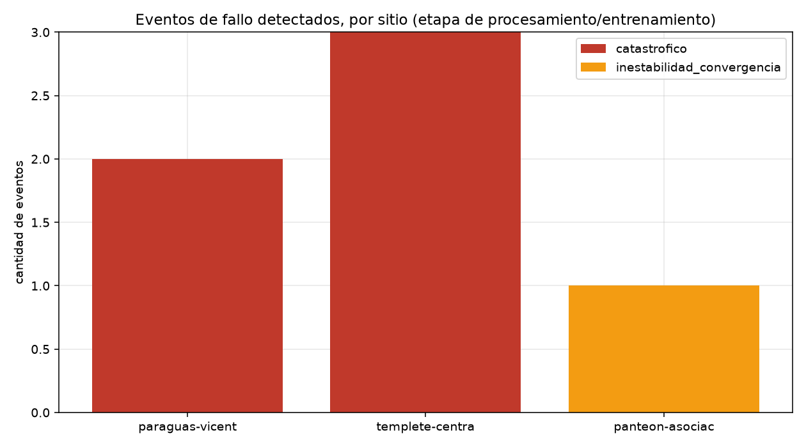

*Gráfico 5.13 — Fallos catastróficos e inestabilidad de convergencia detectados en logs, por sitio.*

A esta tabla debe sumarse el **fallo parcial** de Nerfacto sobre el Panteón Asociación Española (dataset DJI, sección 5.4.2): un output que sí se generó (no catastrófico según la clasificación de la sección 4.9) pero que resultó inutilizable para fines de documentación patrimonial por la presencia masiva de floaters — la categoría de fallo más relevante para H3, y la que menos se refleja en un conteo automático de excepciones de log, dado que requiere la inspección visual cualitativa que sí se realizó en este capítulo (Figura 5.8).

El Templete Central concentra la mayor cantidad de fallos catastróficos (3), en línea con ser el caso donde se probaron más variantes de dataset y configuración (subset secuencial, matching exhaustivo híbrido, múltiples estrategias de Insta360) — es decir, buena parte de estos fallos son atribuibles a la etapa exploratoria del proyecto más que a una fragilidad intrínseca del caso frente a Los Paraguas o el Panteón.

**<u>5.8 Peso del archivo de output, por técnica</u>**

| Caso | Técnica | Formato | Peso |
|---|---|---|---|
| Los Paraguas | SfM | .obj + textura | 755,9 MB + 47,1 MB |
| Los Paraguas | Nerfacto | .ckpt | 168,1 MB |
| Los Paraguas | Splatfacto | splat.ply | 52,3 MB |
| Templete Central | SfM | .obj + textura | 3 934,3 MB + 62,4 MB |
| Templete Central | Nerfacto | .ckpt | 167,9 MB |
| Templete Central | Splatfacto | splat.ply | 74,7 MB |
| Panteón Asociación Española | SfM | .obj + textura | 3 993,9 MB + 83,6 MB |
| Panteón Asociación Española | Nerfacto | .ckpt | 167,9 MB |
| Panteón Asociación Española | Splatfacto | splat.ply | 74,6 MB |

*Tabla 5.10 — Peso del archivo de output final por caso y técnica (dataset DJI, el mismo criterio de B1/B3 — sección 5.4.1). El peso no es una métrica definida para H4 (Capítulo 4, sección 4.3.5); los valores de los outputs Insta360, del mismo orden de magnitud, están documentados en `00-auditoria/output-weights/` sin reproducirse aquí. Fuente: `analyze_output_weights.py`.*

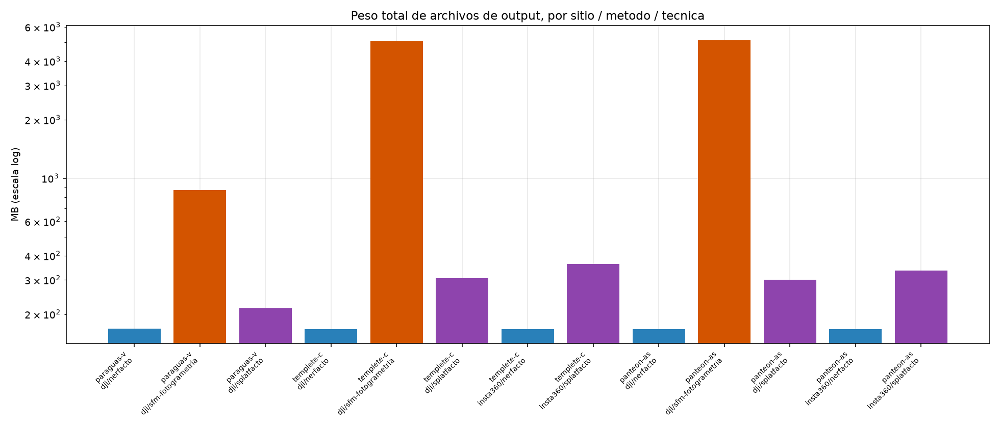

*Gráfico 5.14 — Peso del archivo de output por técnica, comparado entre casos.*

La brecha de peso entre SfM y las otras dos técnicas es de uno a dos órdenes de magnitud (3,9–4,0 GB vs. 75–170 MB), impulsada por la resolución de textura fija de 8192×8192 px adoptada en el pipeline de RealityScan. Esto tiene una implicancia directa para H5 y para el Capítulo 6: la malla SfM, aun siendo la más apta para integración BIM (sección 5.3.3), es la menos práctica de las tres para distribución web sin un paso adicional de decimación/compresión de textura, algo que el pipeline definitivo del Capítulo 6 debería contemplar explícitamente.

**<u>5.9 Tiempo de procesamiento</u>**

| Caso | Nerfacto | Splatfacto |
|---|---|---|
| Los Paraguas | 55 min 32 s | 1 h 13 min 17 s |
| Templete Central | 46 min 1 s | 33 min 41 s |
| Panteón Asociación Española | 1 h 38 min 35 s | 36 min 15 s |

*Tabla 5.11 — Tiempo de entrenamiento (30 000 iteraciones) por caso y técnica (dataset DJI, el mismo criterio de B1/B3 — sección 5.4.1). Los tiempos de los datasets Insta360 están documentados en `00-auditoria/processing-time/`; el tiempo de procesamiento no es una métrica definida para H4 (Capítulo 4, sección 4.3.5), por lo que no se comparan aquí entre dispositivos. Fuente: `analyze_processing_time.py`, medido sobre las carpetas de trabajo originales (Capítulo 4, sección 4.3.6).*

A diferencia del peso de archivo, el tiempo de entrenamiento no muestra un patrón consistente entre técnicas: Splatfacto es más rápido que Nerfacto en Los Paraguas y el Templete Central, pero más lento en el Panteón (36 min 15 s vs. 1 h 38 min 35 s de Nerfacto) — el único caso donde Nerfacto entrena más lento que Splatfacto es, a su vez, el caso donde el output de Nerfacto resultó inutilizable (fallo parcial, sección 5.4.2), lo que sugiere que el tiempo elevado podría estar asociado al mismo problema de divergencia del entrenamiento y no a una propiedad estable de la técnica.

**<u>5.10 Síntesis por hipótesis</u>**

**H1 — Especialización por técnica:** parcialmente confirmada, con matices no anticipados en el planteo original. SfM es, en efecto, la técnica más apta para integración BIM (malla explícita, sección 5.3.3) y la de mayor peso de archivo (sección 5.8). Splatfacto no solo iguala sino que supera consistentemente a Nerfacto en PSNR/SSIM en los tres casos (Tabla 5.4), además de ofrecer mejor tiempo de entrenamiento en dos de los tres sitios DJI y el mejor equilibrio de compatibilidad web (sección 5.6) — su especialización original ("renderizado en tiempo real") queda corroborada, pero la evidencia sugiere que además es, en este conjunto de experimentos, la técnica de mejor desempeño general entre las tres. Nerfacto muestra su mayor fragilidad exactamente donde H1 anticipaba su fortaleza relativa (síntesis de vistas fotorrealista): con complejidad geométrica alta (Panteón) su output resultó inutilizable (fallo parcial, sección 5.7).

**H2 — Preprocesamiento:** se acepta parcialmente. La comparación de reconstrucción sobre el Dataset B curado con ComfyUI (sección 5.2.4) es comparable 1:1 solo para Splatfacto: ahí el preprocesamiento no mejora la fidelidad píxel a píxel (PSNR −1,3 dB, SSIM sin cambios significativos) pero sí la similitud perceptual (LPIPS −32%), con un efecto no uniforme entre frames según la complejidad de la textura de fondo. La comparación de Nerfacto está confundida por un downscale forzado (limitación de memoria del hardware, sección 4.10) y no permite una lectura concluyente en ese caso.

**H3 — Complejidad geométrica:** confirmada para Nerfacto (caída monótona de PSNR, sección 5.4.2), no confirmada de forma directa para Splatfacto (patrón no monótono, con recuperación en el caso de mayor complejidad). La lectura más ajustada a la evidencia es que la complejidad geométrica y ornamental afecta negativamente el desempeño de reconstrucción, pero su efecto está mediado —y en el caso de Splatfacto, posiblemente dominado— por la calidad del registro SfM de entrada, una interacción no contemplada en el planteo original de H3 y que constituye uno de los aportes empíricos de esta tesis.

**H4 — Dataset multi-dispositivo:** en conjunto, la evidencia recogida respalda H4 con más fuerza que cualquier otra hipótesis de esta tesis. El registro SfM final de los datasets solo-DJI y solo-Insta360 fue alto en ambos casos de estudio híbridos (85%–100%, Tabla 5.6), lo que por sí solo no sugiere dificultad. Pero al combinar ambos dispositivos en un único dataset, dos corridas independientes de COLMAP nativo sobre el mismo dataset híbrido del Templete Central dieron resultados opuestos —una terminó en un único componente con 100% de registro (sección 5.5.2), la otra en apenas 0,63% (sección 5.5.3)—, una inestabilidad que **no ocurre con los datasets de un único dispositivo** en ningún caso de esta tesis. La sección 5.5.3 identifica además un mecanismo geométrico concreto detrás de esa inestabilidad: los matches entre imágenes DJI e Insta360 son sistemáticamente mucho más débiles (43 inliers promedio) que los matches dentro de un mismo dispositivo (689 en DJI-DJI, 189 en Insta360-Insta360) — el "puente" que conecta ambos clusters en la reconstrucción es frágil, y su éxito o fracaso parece depender de la traza particular del algoritmo incremental más que de una propiedad estable del dataset. La evidencia complementaria de calidad de render por dispositivo (sección 5.5.5) es consistente con esta lectura: el efecto de usar Insta360 en lugar de DJI no es uniforme —leve en el Templete Central, marcado y de signo variable por técnica en el Panteón—, lo que sugiere que el resultado final depende más de la calidad del registro SfM logrado en cada corrida que del dispositivo en sí. La comparación directa de calidad de render y cobertura del dataset **combinado** (no solo DJI o Insta360 por separado) frente a los datasets de un único dispositivo —la comparación que realmente formula H4— sigue pendiente hasta lograr una reconstrucción híbrida estable y completar su entrenamiento (sección 5.5.2).

**H5 — Compatibilidad web y reproducibilidad:** evidencia documental a favor de una especialización clara entre técnicas (sección 5.6): SfM y Splatfacto tienen rutas de publicación web directas o casi directas; Nerfacto no. La validación experimental completa (carga real de al menos un modelo de cada técnica en un visor web) queda pendiente.

**<u>5.11 Cierre del capítulo</u>**

De los cinco benchmarks diseñados en el Capítulo 4, tres se ejecutaron con resultados completos (B1, B3, B5 en su componente documental), y dos se ejecutaron parcialmente: B4, con hallazgos metodológicos relevantes que exceden el alcance original, y B2, cuya comparación de reconstrucción solo es comparable 1:1 para Splatfacto (sección 5.2.4). La evidencia recogida permite, no obstante, una lectura sustantiva de cuatro de las cinco hipótesis de trabajo. Dos hallazgos destacan por encima del resto: la interacción no anticipada entre complejidad geométrica y calidad de registro SfM como determinantes conjuntos del desempeño de Splatfacto (sección 5.4.2), y la evidencia reunida en torno a H4 sobre la fragilidad de los datasets híbridos multi-dispositivo —componentes de reconstrucción desconectados con reporte automático engañoso en una corrida (sección 5.5.2), una segunda corrida del mismo dataset con un resultado real de registro casi nulo (sección 5.5.3), y un mecanismo geométrico identificado y cuantificado que explica ambos resultados: los matches entre imágenes de distintos dispositivos son sistemáticamente mucho más débiles que los matches dentro de un mismo dispositivo (sección 5.5.3)—. Estos resultados, junto con las limitaciones y tareas pendientes identificadas en cada sección, se traducen en el Capítulo 6 en un pipeline definitivo documentado y en criterios prácticos de selección de técnica según el objeto patrimonial a relevar.

*— Continúa en Capítulo 6: Pipeline Definitivo y Propuesta de Integración HBIM —*
