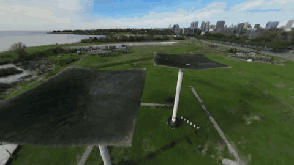
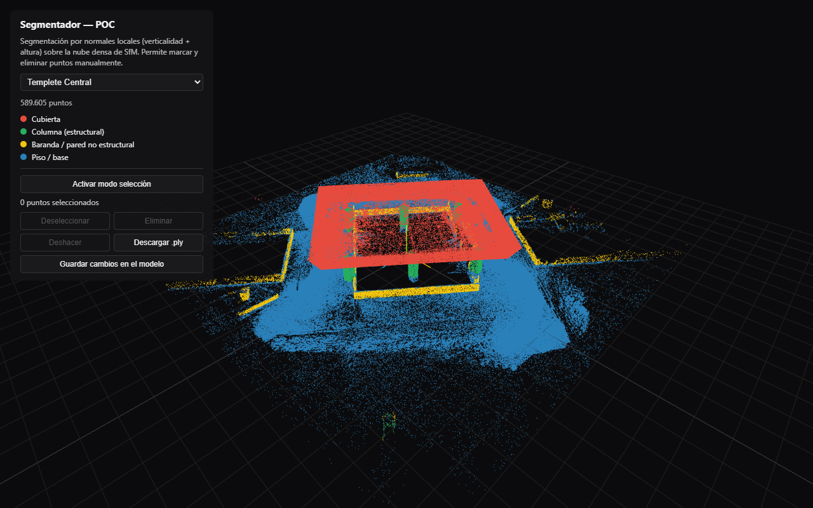
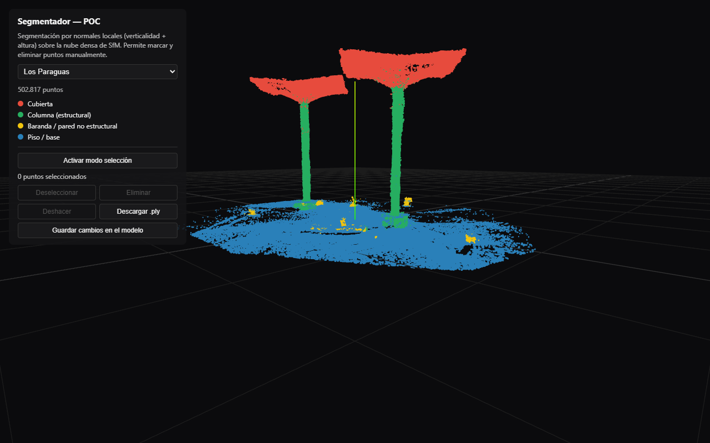
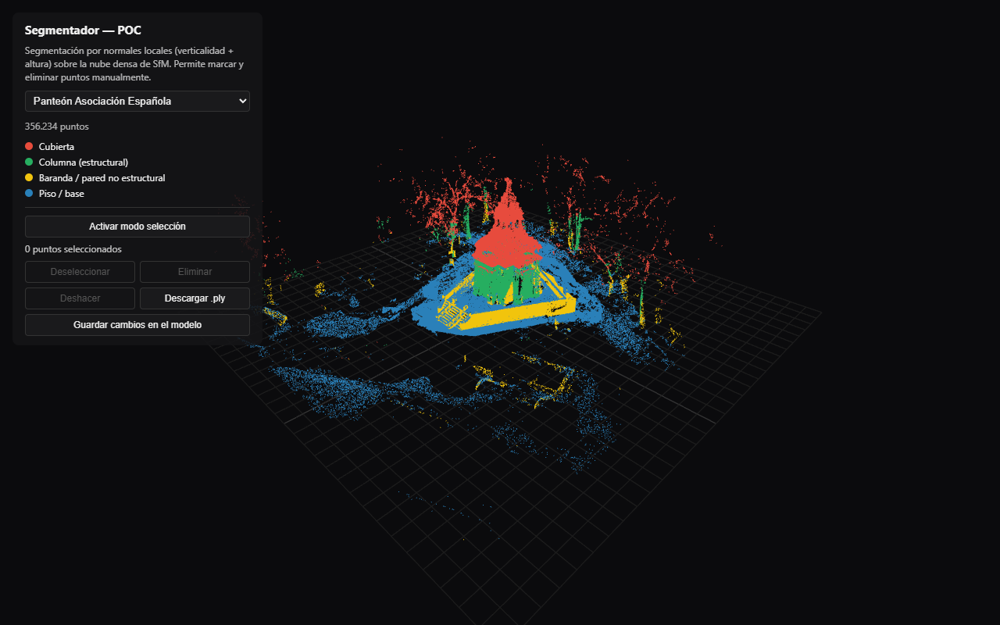
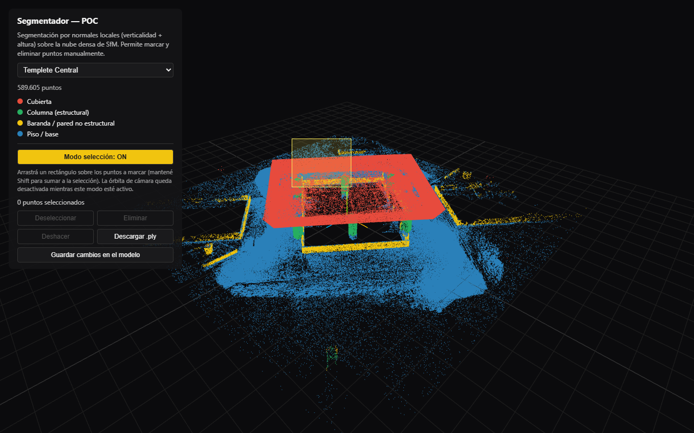
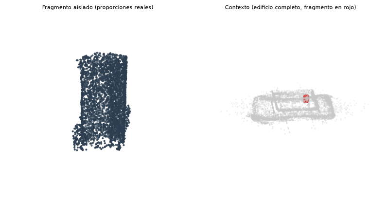

**CAPÍTULO 6**

**Pipeline y propuesta de integración HBIM**

Este capitulo tiene como objetivo no solo documentar el conocimiento que se gano a partir de la busqueda de validacion de las hipotesis en el capitulo anterior, sino tambien definir, a partir de estas conclusiones, cual es el pipeline definitivo de reconstruccion en 3D recomendado para asegurar dos fines:

- La integracion con HBIM

- La construccion de un archivo digital web

En la busqueda por garantizar este doble objetivo se genera una nueva propuesta que tiene el fin de asegurar mayor inteligencia en la interpretacion de los datos al momento de realizar la integracion: Se trata de la propuesta de un paso adicional dentro del flujo de trabajo que no habia sido previsto al momento de disenar la experimentacion. La oportunidad de sumar una herramienta propia de segmentacion dentro del pipeline que garantice una lectura mas clara de la arquitectura que brinda la nube de puntos densa y permita introducirnos en un flujo de reconstruccion con BIM de forma mas rapida y asertiva. 

Lo que vamos a repasar durante este capitulo es la evidencia empirica que ganamos para fundamentar esta recomendacion y vamos a cruzar esta informacion con material academico que nos permita validar o contradecir algunas de las premisas que afirmamos en el capitulo previo. Podria afirmarse que este capitulo es una de las piezas claves de esta investigacion porque pretende dar respuesta a la principal pregunta que plantea esta tesis: ¿Puede una tecnica de reconstruccion de computer vision agilizar un trabajo de digitalizacion de obras construidas y colaborar en la construccion de un archivo digital?. 

**<u>6.1 Criterios de selección de técnica según el objeto patrimonial</u>**

El hallazgo central del Capítulo 5 es que **no existe una técnica óptima en términos absolutos** (confirmando H1), pero identificamos potencialidad y desventajas en cada una de ellas para entender como estas tecnicas pueden ser mas o menos optimas para nuestro objetivo. Esta evidencia esta plasmada en la Tabla 6.1. De las tres técnicas evaluadas, solo dos —SfM y 3DGS— entran en los pipelines definitivos de este capítulo; Nerfacto queda explícitamente excluida, por las razones que documentamos. 

| Técnica                 | Rol en los pipelines definitivos                                                                                                                                                      | Evidencia (Capítulo 5)                                                                                                                                                                                                                                                                                                                                                                                         |
| ----------------------- | ------------------------------------------------------------------------------------------------------------------------------------------------------------------------------------- | -------------------------------------------------------------------------------------------------------------------------------------------------------------------------------------------------------------------------------------------------------------------------------------------------------------------------------------------------------------------------------------------------------------- |
| **SfM (Fotogrametria)** | Registro de cámaras y geometría de partida para Splatfacto. Output de nube de puntos para pipeline de segmentacion para integracion HBIM y mesh texturizada como respaldo documental. | Es la unica tecnica necesaria para correr otros procesos como 3DGS. Su output de nube de puntos tiene una integracion optima para flujos HBIM. Define geometria explicita a traves de su mesh (sección 5.2.3).                                                                                                                                                                                                 |
| **Splatfacto (3DGS)**   | Procesamiento protagonista para el pipeline de construccion de archivo digital web. (sección 6.2.3)                                                                                   | Superó a Nerfacto en PSNR/SSIM en los tres casos de estudio (Tabla 5.7); mejor compatibilidad de publicación web entre las tres técnicas (sección 5.6); archivo liviano (Tabla 5.16)                                                                                                                                                                                                                           |
| **Nerfacto (NeRF)**     | **Excluida de ambos pipelines definitivos**                                                                                                                                           | No ofrece una ventaja decisiva en ningún criterio de uso evaluado en esta tesis: peor que Splatfacto en fidelidad de render en los tres casos (Tabla 5.7); sin ruta de publicación web estándar (sección 5.6); no produce geometría explícita utilizable para BIM (sección 6.3.1); y su output fue directamente inutilizable en el caso de mayor complejidad geométrica (fallo parcial, secciones 5.4.2 y 5.7) |

*Tabla 6.1 — Rol de cada técnica en los pipelines definitivos propuestos, y evidencia que respalda la exclusión de Nerfacto.*

Que NeRF es la tecnica menos compatible con nuestro objetivo es algo que algunos investigadores ya venian relevando en el material que consultamos para entender el estado del arte: Rangelov et al. (2026), en una comparación directa entre NeRF y 3DGS sobre entornos interiores y exteriores, encuentran el mismo patrón —3DGS supera a NeRF en eficiencia computacional y reducción de ruido—. 

Hay excepciones puntuales que descubrieron otros investigaciones, sobre el potencial de NeRF cuando el dataset de entrada es pobre, aparentemente esta tecnica tiene mayor poder de reconstruccion con registros escasos. Croce et al. (2024) es uno de los autores que valida esta afirmacion demostrando como algunos resultados de NeRF superan procesamientos de fotogrametria si el dataset tiene pocas imagenes o estas tienen baja resolucion. Como parte de nuestra recomendacion del pipeline es la creacion de un registro completo que reconstruya de forma completa la obra brindando recorridos en 360 completos en al menos tres niveles de altura podriamos afirmas que la problematica de un dataset incompleto puede ser descartada dentro del flujo de trabajo que recomendamos. 

Se puede afirmar que la tecnica de NeRF tiene mucha potencialidad para la resolucion de otros casos de uso, posiblemente vinculados a la reconstruccion de escenarios para eventos cinematograficos o generacion de material audiovisual (teniendo en cuenta la potencialidad de la tecnica para generar nuevos paths de camara y renderizar videos nuevos). La siguiente animacion es un ejemplo de esto, la prueba que se hizo en este caso fue la construccion de un path de camaras nuevo utilizando el visor de Nerfstudio y renderizando nuevamente en base a la reconstruccion de NeRF. Si bien la calidad visual del cielo tiene defectos se logro reconstruir puntos de vista unicos de la escena. Este experimento dio cuenta del potencial de NeRF para generar resultados visuales unicos que pueden ser de utilidad para producciones de imagen y sonido. Si bien el potencial es claro, se trata de un caso de uso que se aleja bastante del objetivo de nuestra investigacion. 

*Figura 6.1 — Los Paraguas, Nerfacto: recorrido de cámara nuevo, generado con el visor de Nerfstudio, no presente en el video de captura original. Fuente: `nerf-custompath.mp4`.*

Un aspecto importante para destacar de la Tabla 6.1 es la incidencia de un buen registro de imagenes. El exito tanto de SfM como de 3DGS depende de la calidad del registro y que tan completo es el recorrido que plantea el dataset. El pipeline que proponemos incorpora esta aclaracion para garantizar el exito del flujo de trabajo (sección 6.2.1). 

**<u>6.2 Pipeline definitivo: de la captura a BIM y al archivo digital web</u>**

A continuacion vamos a especificar las caracteristicas del pipeline recomendado para llevar de punta a punta un proceso de reconstruccion 3D que permita integracion con BIM y subida a un archivo digital. 

El pipeline parte de la captura, donde se recomienda un unico dispositivo (ya se DJI Neo 2, o Insta360, priorizando el primero si la obra a capturar tiene altura y hay que registrar cubiertas). El proceso de capture incluye una recomendacion importante: cuanto mas completo sea el dataset y el recorrido que se plantee en el video mejor va a ser la reconstruccion y la interpretacion de la geometria en el procesamiento. Luego de la captura se genera el proceso de SfM donde recomendamos en concreto dos herramientas: Colmap a traves de Nerfstudio o RealityScan. La primer herramienta es idonea si el usuario busca realizar los entrenamientos con un unico software, y la ventaja principal de RealityScan es que, si bien es una herramienta con limitaciones en la configuracion de la corrida de SfM, su tiempo de procesamiento es mucho mas rapido y sus resultados son optimos. Como resultado de este proceso el pipeline genera dos componentes: una nube de puntos densa que representa la geometria de la escena y un archivo en formato malla texturizada que contiene la geometria solida de la escena. En este punto es donde en el pipeline se genera una bifurcacion que habilita dos escenarios:

a) Bifurcacion 1: Integracion con BIM a partir de una segmentacion de la nube de puntos densa

b) Bifurcacion 2: Generacion de un .splat utilizando Gaussian Splatting para subida de la escena digital a web para el archivo. 

En la primera bifurcacion se propone un sub pipeline donde cobra protagonismo un paso adicional propuesto por este proyecto de investigacion: la segmentacion a partir de un algortimo que interpreta la geometria de la nube de puntos y permite categorizar y subdividir sus componentes por el objeto arquitectonico: cubierta, mamposteria, suelo, etc. Este paso adicional es una propuesta de esta tesis que tiene como objetivo reducir tiempos y optimizar la interpretacion del modelo de cara a un proceso de reconstruccion en BIM, la seccion 6.2.2 elabora con mayor profundidad esta propuesta. 

La segunda bifurcacion tiene como objetivo generar un archivo .splat que va a utilizarse para mostrar la geometria del edificio en navegadores webs. El objetivo de este sub pipeline es aprovechar las bondades de la tecnica de Gaussian Splatting para reconstruir con precision geometrica escenas de gran complejidad, y permitir a los usuarios la descarga del .splat del edificio con el fin de comprender y entender la obra. 

Una de las principales conclusiones de la H1 es entender que tecnica es mejor para la reconstruccion 3D y cuales pueden aportar dentro de nuestro objeto de estudio, y podemos afirmar que tanto 3DGS como SfM aparecen como etapas complementarias de un mismo flujo de trabajo, algo con lo que algunos autores ya venian explorando como Lyu et al. (2025) que plantea en el texto "3DGSR: Implicit Surface Reconstruction with 3D Gaussian Splatting" la posibilidad de generar un hibrido entre 3DGS y NeRF. 

La Tabla 6.1 permite visualizar de forma grafica la propuesta y los pasos del pipeline completo de reconstruccion. 

*Figura 6.2 — Pipeline definitivo: tronco común, rama HBIM y rama archivo digital web. Fuente: `build_pipeline_diagram.py`.*

**6.2.1 Comienzo del pipeline con SfM y aprendizajes**

Esta seccion propone profundizar en aquellos aspectos aprendidos durante los experimentos que proponen validar las distintas hipotesis, y comprender cuanto de aquello sirvio para establecer hoy por hoy un criterio en comun que nos permita definir cual es el flujo de trabajo que se recomienda. 

La captura con un unico dispositivo es uno de los aspectos mas solidos que logramos validar durante el Capitulo 5. Se trata de uno de los hallazgos mas importantes y solidos de esta tesis y pueden consultarse en las secciones 5.5.2–5.5.6.  Los pipelines definitivos de esta tesis, en consecuencia, **no combinan dispositivos de captura** dentro de un mismo dataset; DJI Neo 2 e Insta360 X5 son alternativas válidas usadas en solitario (Capítulo 3, secciones 3.6.1 y 3.6.3), no complementos entre sí.

Otro aspecto importante que validamos tiene que ver con la posibilidad de someter al dataset a un preprocesamiento de imagenes. Los pipelines de limpieza que generamos utilizando ComfyUI dieron cuenta de que ambas variantes de investigacion (por un lado la eliminacion de distraciones y por otro la eliminacion del contexto) empeoran notablemente los resultados de la reconstruccion en relacion al dataset sin procesar. Esta conclusion fue determinante para definir que **el pipeline final no necesita un paso adicional de procesamiento** sino que el dataset original es suficiente para lograr buenos resultados. Si analizamos en profundidad la evidencia que sobre este tema en materia de investigacion podemos sostener que otros investigadores han llegado a conclusiones parecidas: Lu et al. (2026) construyeron el benchmark más grande hasta la fecha para reconstrucción "distractor-free" (DF3DV-1K, más de mil escenas) y encontraron que incluso los métodos especializados en este problema —más sofisticados que la combinación de detección e *inpainting* usada en esta tesis— logran solo mejoras modestas (+0,96 dB PSNR) sobre un dataset curado específicamente para evaluarlos. 

Un hallazgo de esta investigacion **en relacion al procesamiento de SfM es la importancia de la verificacion binaria**. Se recomienda sumar un paso estandar de verificacion binaria al momento de validar la tasa de registro reportada por el wrapper de conversion (que en Nerfstudio suele ser ns-process-data). En nuestro caso exploramos tanto el uso de RealityScan como el de Nerfstudio para la generacion de COLMAP, ambas herramientas nos permitieron generar procesos de SfM exitosos, en algunos casos, se recomienda probar ambas y elegir el mejor resultado para avanzar con el pipeline (Capítulo 4, sección 4.4.3).  El registro binario recomendado como paso adicional permite identificar si el registro reportado es bajo y si hay componentes desconectados en la reconstruccion (una problematica que se hizo frecuente en datasets de dispositivos hibridos pero que puede ser una problematica al momento de generar un resultado de COLMAP exitoso). 

**6.2.2 Integracion con HBIM**

Para garantizar la integracion con sistemas BIM el pipeline propone utilizar la nube de puntos densa como referencia de la geometria general del edificio, y utilizar la malla texturizada como una pieza adicional que simplemente permite constatar como resultado documental. Teniendo en cuenta la parametrizacion de componentes que caracteriza a la metodologia BIM **se propone una segmentacion de la nube de puntos** con el fin de mejorar la interpretacion general del modelo y brindarle a programas como Revit o Archicad un archivo de nube integrado que ya cuente con el desgloce y la identificacion de sus componentes principales a nivel arquitectonico. La segmentacion propuesta abarca componentes commo cubierta, columnas, paredes o barandas, y piso. Con el fin de realizar esta segmentacion se utilizo el siguiente [segmentation-multi-site.py](https://thesis-3d-reconstruction.vercel.app/?script=poc_segmentation_multi_site.py#scripts)

Ademas de la segmentacion se propone el uso de un editor online que le permita a los usuarios manipular la nube de puntos generada y poder eliminar puntos del entorno si lo consideran necesario. Este mismo visor permite la posibilidad de exportar en formato .ply la nube segmentada y editada. Tanto este archivo .ply como el .splat que se genere con el procesamiento de Splatfacto van a ser los dos archivos que van a acompanar la publicacion de las obras en el archivo digital. 

Hay una parte del flujo de HBIM que queda por fuera del alcance de esta tesis y tiene que ver con la integracion de este archivo .ply dentro de un entorno de trabajo (como por ejemplo en Revit), y como la importacion de este archivo como referencia de scan-to-BIM puede convertirse en parte del proceso de modelado y parametrizacion del edificio. Este proyecto de investigacion propone de forma conceptual esta integracion y disponibiliza los archivos segmentados y editados, pero no implementa la solucion ya que es parte de un flujo de trabajo que escapa del fin de esta tesis. El pipeline propone documentar tambien y conservar la malla texturidada producto de SfM para acompanar cualquier referencia adicional del modelo que un proceso de BIM necesite con el fin de entender la complejidad de la obra. 

**6.2.3 Rama hacia el archivo digital web**

La otra rama del pipeline propone utilizar entrenamiento de Gaussian Splatting para generar un archivo de gaussianas que permita representar la escena para visualizarse en cualquier navegador web utilizando Play Canvas como dependencia para el visualizador. Una vez obtenido el archiv en formato .ply/.splat se invita a la utilizacion de SuperSplat para la edicion manual del mismo, esta herramienta open source permite editar gaussianas de escenas de gran complejida y borrar primitivas con el fin de limpiar la escena y hacer foco en la obra de arquitectura. La publicacion en el archivo digital propone publicar tanto el archivo segmentado para HBIM como el archivo .splat con la escena. En el siguiente enlace se puede visualizar una muestra del archivo digital propuesto: [Archivo digital](https://thesis-3d-reconstruction.vercel.app/#archivo-digital). 

**<u>6.3 Detalle de implementación: segmentación semántica de la nube de puntos</u>**

Como mencionamos con anterioridad, una de las propuestas de esta tesis es sumar una capa de segmentacion al resultado de SfM para poder enriquecer el proceso de BIM. Esta segmentacion semantica conto con dos exploraciones: por un lado la segmentacion con un script y por otro la exploracion de una capa adicional de inteligencia utilizando un VLM como modelo interpretativo de la geometria. Durante esta seccion se desarrolla en profundidad los resultados de las dos exploraciones. 

Ese paso de conversión no es del todo nuevo en la literatura: Lyu et al. (2025) propone implementar una capa division semantica de gaussianas utilizando distancia con signo (SDF) dentro de las propias gaussianas para extraer superficies explícitas de un modelo 3DGS entrenado. Lo interesante de esta propuesta es que, si bien es un campo en plena exploracion y no una linea de investigacion activa, lo cierto  es que la evolucion en modos de segmentacion de escenas gaussianas puede derivar en la construccion de una ruta directa de Splatfacto a BIM en el futuro.

**6.3.2 Implementación: segmentación semántica de la nube de puntos**

El paso 1 de la rama HBIM (sección 6.2.2) requiere que la nube de puntos densa de SfM se organice, antes de servir como referencia *scan-to-BIM*, en un trabajo de limpieza y clasificación que hoy recae por completo en el modelador BIM: recorrer la nube completa e identificar a mano qué región corresponde a cada elemento constructivo (cubierta, columna, muro, piso) antes de empezar a levantar geometría paramétrica encima. Este cuello de botella está documentado en la literatura de *scan-to-BIM* para patrimonio —Romero-Jarén y Arranz (2021) lo describen como el paso "muy costoso en tiempo y enteramente delegado al trabajo manual de expertos, lejos de estar automatizado"— y motivó una prueba de concepto adicional dentro de esta tesis: un clasificador geométrico que segmenta automáticamente la nube densa de SfM en las cuatro clases relevantes para BIM antes de exportarla como referencia.

El script `poc_segmentation_multi_site.py` (Capítulo 4, sección 4.9) implementa esta clasificación sin redes neuronales ni datos de entrenamiento, apoyándose únicamente en propiedades geométricas locales de la nube:

1. **Nivelado**: ajuste del plano de piso por RANSAC y rotación de la nube para que quede horizontal, necesario porque ni RealityScan ni COLMAP nativo garantizan que el eje vertical del archivo crudo sea el "arriba" real de la obra (sección 5.4.3 documenta un caso concreto de este problema en Los Paraguas).
2. **Verticalidad**: estimación de normales locales (PCA sobre vecinos cercanos, o normales precalculadas cuando el archivo las trae) para distinguir superficies horizontales (techo/piso) de superficies verticales (muro/columna).
3. **Bandas de altura**: detección de picos de densidad en el histograma de alturas para ubicar la banda de techo y la banda de piso de cada caso, sin asumir una altura fija.
4. **Columna vs. elemento no estructural**: agrupamiento de los puntos verticales en celdas de planta; una celda se clasifica como columna estructural si alcanza una fracción alta de la altura total techo-piso, y como baranda/pared no estructural si se corta antes.

La Tabla 6.2 resume el resultado sobre los tres casos de estudio, y las Figuras 6.2 a 6.4 muestran la clasificación resultante en el visor web desarrollado para esta tesis (`06-sitio-web`, ruta `/segmentador`).

| Caso de estudio                                         | Puntos totales | Cubierta | Columna | Baranda/pared no estructural | Piso/base |
| ------------------------------------------------------- | -------------- | -------- | ------- | ---------------------------- | --------- |
| Templete Central                                        | 589.605        | 150.000  | 19.094  | 33.651                       | 386.860   |
| Los Paraguas                                            | 502.817        | 196.453  | 127.293 | 6.044                        | 173.027   |
| Panteón Asociación Española (post-filtro de vegetación) | 356.234        | 39.346   | 48.555  | 96.249                       | 172.084   |

*Tabla 6.2 — Conteo de puntos por clase resultante de la segmentación automática, tres casos de estudio.*

*Figura 6.3 — Templete Central: las cuatro clases mapean directamente a categorías de Revit (Roofs, Structural Columns, Railings, Floors).*

*Figura 6.4 — Los Paraguas: la doble curvatura de las cubiertas se resuelve correctamente pese a no ser una geometría plana.*

*Figura 6.5 — Panteón Asociación Española: el filtrado por color (índice ExG) excluye la vegetación circundante antes de clasificar, evitando que contamine las clases estructurales.*

**Control de calidad humano.** La clasificación puramente geométrica no es perfecta —el caso del Panteón, con arboledas cercanas que en algunos tramos comparten color con la pátina de la cúpula, y el caso de Los Paraguas, donde el borde curvo de la cubierta requirió un ajuste específico para no confundirse con piso, son evidencia directa de esto dentro de esta misma tesis—. Por esa razón se extendió el visor con una herramienta de edición manual: selección de puntos por rectángulo, eliminación, deshacer y guardado directo sobre el archivo segmentado (Figura 6.6). Esto no es un detalle secundario del visor sino la respuesta concreta a una limitación reconocida en la literatura: Croce et al. (2023) y Pan et al. (2024) framean sus propuestas como *"semi-automáticas"* precisamente porque ningún clasificador —ni el geométrico simple de esta tesis, ni los basados en aprendizaje profundo de la literatura relevada— elimina la necesidad de una revisión humana antes de que el resultado se use como base de un modelo BIM.

*Figura 6.6 — Editor manual del visor: control de calidad humano sobre la clasificación automática antes de exportar por clase.*

**Respaldo en la literatura y posicionamiento de este aporte.** La automatización de este paso —comúnmente llamada segmentación semántica de nubes de puntos para *scan-to-BIM*— es un área activa de investigación. Romero-Jarén y Arranz (2021) proponen un método de segmentación y clasificación automática de elementos BIM (pisos, techos, muros, columnas) a partir de nubes de puntos de interiores; Buldo et al. (2023) documentan un flujo *scan-to-BIM* específico para patrimonio cultural con segmentación automática y modelado paramétrico-adaptativo de sistemas abovedados; Croce et al. (2023) combinan clasificación por Random Forest con reconstrucción H-BIM semi-automática sobre claustros medievales; y Pan et al. (2024) usan una red neuronal profunda (KP-SG) para llevar nubes de puntos semánticas a modelos BIM semánticos en el contexto de un gemelo digital patrimonial. Frente a ese estado del arte, el aporte de esta tesis es modesto pero honesto: una clasificación geométrica simple —sin entrenamiento, sin dataset anotado, ejecutable con los mismos recursos consumer-grade del resto del pipeline (Capítulo 4, Tabla 4.2)— que demuestra, sobre los tres casos de estudio reales de esta investigación, que incluso ese enfoque liviano produce clases usables como punto de partida para la rama HBIM (sección 6.2.2). La adopción de un clasificador basado en aprendizaje profundo (siguiendo, por ejemplo, el enfoque de Pan et al., 2024) queda documentada como línea de trabajo futura (Capítulo 7), no como parte de esta implementación.

**6.3.3 Exploración: segmentación asistida por un modelo de visión (VLM)**

El "control de calidad humano" descrito en la sección 6.3.2 —revisar y corregir a mano los errores del clasificador geométrico— es exactamente el cuello de botella que la literatura de *scan-to-BIM* señala como no resuelto (Romero-Jarén y Arranz, 2021). Como exploración adicional, no contemplada en el diseño original de esta tesis, se probó si un modelo de visión liviano (VLM, *vision-language model*) podía reducir ese trabajo manual: en lugar de reemplazar el clasificador geométrico, se lo usó para **revisar** su decisión más frágil —columna estructural vs. baranda/pared no estructural, hoy resuelta con un umbral fijo de altura (sección 6.3.2, paso 4)— mostrándole a un modelo una imagen de cada fragmento y preguntándole cuál de las dos clases le corresponde.

El pipeline construido para esta prueba: los puntos ya clasificados como columna o baranda por el método geométrico se agrupan por separado (dentro de cada clase) en fragmentos conectados espacialmente, cada fragmento se renderiza en dos paneles —aislado, con sus proporciones reales de alto y ancho, y en contexto dentro del edificio completo—, y la imagen se envía a un modelo de lenguaje-visión corriendo localmente a través de un nodo propio expuesto por la API de ComfyUI, con la pregunta de si el fragmento se parece más a una columna (alto y angosto) o a una baranda (bajo y horizontal). Se probaron dos modelos livianos, elegidos por poder correr en el mismo hardware consumer-grade del resto del pipeline (Capítulo 4, Tabla 4.2): Moondream2 (1.6B parámetros), corrido sobre los tres casos de estudio, y Qwen2-VL-2B-Instruct (2B), corrido sobre el caso de referencia como segundo punto de comparación.

| Modelo               | Caso de estudio             | Fragmentos evaluados            | Acierto         | Sesgo observado    |
| -------------------- | --------------------------- | ------------------------------- | --------------- | ------------------ |
| Moondream2           | Templete Central            | 15 (8 columna, 7 baranda)       | 7/15 (47%)      | 100% "baranda"     |
| Moondream2           | Panteón Asociación Española | 19 (9 columna, 10 baranda)      | 10/19 (53%)     | 100% "baranda"     |
| Moondream2           | Los Paraguas                | 7 (2 columna, 5 baranda)        | 5/7 (71%)       | 100% "baranda"     |
| Moondream2           | **Total, tres sitios**      | **41 (19 columna, 22 baranda)** | **22/41 (54%)** | **100% "baranda"** |
| Qwen2-VL-2B-Instruct | Templete Central            | 15 (8 columna, 7 baranda)       | 8/15 (53%)      | 100% "columna"     |

*Tabla 6.3 — Acierto de dos modelos de visión livianos frente a la etiqueta del clasificador geométrico, sobre los fragmentos de columna/baranda de los tres casos de estudio (Moondream2) y del caso de referencia (Qwen2-VL-2B-Instruct). Fuente: `poc_segmentation_vlm.py`, `qwen_batch_test.py`.*

La Tabla 6.3 muestra un patrón más revelador que el porcentaje de acierto en sí: en los cuatro sitios/modelos evaluados, cada corrida respondió lo mismo para absolutamente todos sus fragmentos, sin una sola excepción, con un sesgo opuesto entre los dos modelos (Moondream2 siempre "baranda", Qwen2-VL siempre "columna"). El 54% de acierto total de Moondream2 no refleja que el modelo esté evaluando la forma del fragmento caso por caso —es, esencialmente, el resultado de responder siempre lo mismo sobre un conjunto con una proporción de clases relativamente pareja (19 columna contra 22 baranda)—, y el hecho de que ese mismo sesgo se sostenga sin variación en tres edificios de geometría, altura y complejidad ornamental completamente distintas (Capítulo 3) descarta que sea una particularidad de un solo caso de estudio: es una propiedad del modelo frente a este tipo de imagen, no del dataset. Un chequeo adicional con figuras geométricas sintéticas (un rectángulo negro simple, sin nube de puntos de por medio) confirmó además que el sesgo no es específico del render de nube de puntos: los dos modelos repitieron la misma respuesta única incluso ante una forma trivial e inequívoca.

*Figura 6.7 — Ejemplo de clasificación fallida: fragmento de 2,23 m de altura, geométricamente una columna, visualmente inequívoco en el panel izquierdo — el modelo respondió "baranda" de todas formas. Fuente: `poc_segmentation_vlm.py`.*

**Lectura del resultado.** La infraestructura construida para esta prueba funciona de punta a punta —nodo de ComfyUI expuesto por API, entorno aislado para correr un modelo con dependencias incompatibles con las del resto del pipeline sin afectarlo, agrupamiento de fragmentos, render y reclasificación— y queda disponible como herramienta reusable. El resultado de clasificación en sí, sin embargo, es negativo: ni Moondream2 ni Qwen2-VL-2B-Instruct superaron al umbral geométrico simple en esta tarea puntual, con esta forma de preguntarles. La explicación más probable no es que la idea sea inviable, sino que estos dos modelos —livianos y entrenados mayormente sobre fotografías naturales— no generalizan bien a un tipo de imagen (una nube de puntos dispersa, renderizada de forma abstracta) que probablemente no vieron durante su entrenamiento, y que forzar una respuesta entre solo dos opciones, sin darle al modelo la posibilidad de contestar "no estoy seguro", probablemente amplifica ese problema en vez de dejarlo en evidencia. Queda como línea de trabajo futura (Capítulo 7) probar esta misma idea con un modelo de mayor tamaño, con *fine-tuning* sobre ejemplos de nubes de puntos arquitectónicas, o con un render más realista (por ejemplo, una malla sombreada en vez de puntos dispersos) antes de descartar el enfoque.

Sobre esta última hipótesis, un chequeo acotado descartó al menos su componente más económico de probar. La nube de puntos de origen (`nube-densa.xyz`) ya trae color real por punto, no solo geometría, pero el render usado en la prueba lo ignoraba en favor de un color plano uniforme. Repitiendo la clasificación sobre cinco fragmentos de Templete Central (tres columnas reales, mal clasificadas en la corrida original, y dos barandas, bien clasificadas) pero coloreando cada punto con su color real en vez de plano, Moondream2 volvió a responder "RAILING" en el 100% de los casos —sin ningún cambio respecto a la corrida original (`poc_vlm_color_render_test.py`)—. El color fotográfico por sí solo no alcanza para revertir el sesgo. Lo que queda sin probar, entonces, es específicamente la continuidad de la superficie: una malla sombreada (la textura de RealityScan generada para los tres sitios, entre 800 MB y 4 GB por archivo según el caso) es una superficie sólida y continua, muy distinta de un scatter de puntos dispersos aunque ambos tengan el mismo color. No se llegó a evaluar esa variante por el costo de cargar y renderizar mallas de ese tamaño con el hardware disponible (Capítulo 4).

**6.3.4 Limitación reconocida**

La propuesta de integración con Revit/BIM propiamente dicha —los pasos 4 a 6 de la rama HBIM (sección 6.2.2)— no fue validada con un modelador BIM real ni con un caso de uso profesional dentro de esta tesis; su valor es orientar la siguiente etapa de trabajo (Capítulo 7), no cerrar la pregunta de integración HBIM. La segmentación semántica de la sección 6.3.2 sí es una implementación funcional y validada sobre los tres casos de estudio —a diferencia del resto de la propuesta HBIM, que permanece conceptual—, pero se detiene en la nube de puntos clasificada: no genera geometría paramétrica, no exporta a un formato nativo de Revit (.rvt) ni a un formato de intercambio BIM estándar (IFC), y no fue puesta a prueba por un profesional de modelado BIM. Es, en los términos de la literatura citada, un paso semi-automático de preparación de datos, no un pipeline scan-to-BIM completo.

**<u>6.4 Lineamientos para el archivo digital de patrimonio arquitectónico web</u>**

A partir de la evidencia de la sección 5.6 (H5), se proponen los siguientes lineamientos para el repositorio/plataforma web mencionado como parte del alcance de esta tesis (Capítulo 1, sección 1.6.1):

- **3DGS (Splatfacto) como formato principal de exploración interactiva**, por su combinación de peso liviano (Tabla 5.16), buen desempeño de calidad visual (Tabla 5.7) y compatibilidad directa con visores web (sección 5.6).
- **La malla SfM (.glTF) como capa de referencia geométrica y documental**, útil para mediciones aproximadas y para usuarios que requieran un modelo poligonal (por ejemplo, integración con visores BIM ligeros), pese a su mayor peso — se recomienda ofrecer una versión decimada específicamente para web, distinta de la usada como insumo para la integración HBIM (sección 6.3).
- **Descarga dual: el .splat limpio de 3DGS y el .ply segmentado por clase**, uno por cada rama del pipeline (secciones 6.2.2 y 6.2.3) — el usuario del archivo digital puede llevarse tanto el modelo interactivo completo (rama del archivo digital web) como la nube de puntos ya clasificada por elemento constructivo (rama HBIM), ya implementado en el visor de esta tesis (`06-sitio-web`, ruta `/segmentador`).
- **Metadatos de trazabilidad por modelo**: sitio, técnica, dispositivo(s) de captura, fecha de relevamiento y estado de conservación documentado, siguiendo el mismo criterio de trazabilidad que esta tesis aplicó internamente a nivel de logs (Capítulo 4, sección 4.9) — relevante en particular para casos como el Panteón Asociación Española, cuyo estado de conservación condiciona la interpretación de cualquier resultado (Capítulo 4, sección 4.10).

**<u>6.5 Recomendaciones de infraestructura</u>**

El hardware consumer-grade utilizado en esta tesis (Capítulo 4, Tabla 4.2) resultó suficiente para completar los tres casos de estudio, pero con un costo de tiempo no despreciable —hasta 1 h 38 min de entrenamiento por modelo (Tabla 5.17)— y una incidencia directa en la tasa de fallos catastróficos (Capítulo 5, sección 5.7), concentrada en las etapas de mayor demanda de memoria (fusión densa de COLMAP, `ParallelDataManager` de Nerfacto sobre datasets grandes). Para un equipo de gestión patrimonial que busque adoptar este pipeline de forma sostenida, se recomienda:

- Priorizar una GPU con mayor VRAM disponible (8–12 GB o más) sobre un aumento de velocidad de cómputo puro, dado que las fallas observadas fueron predominantemente de memoria, no de tiempo.
- Splatfacto toleró el dataset completo de los tres casos de estudio sin necesidad de submuestreo, incluso en el sitio de mayor volumen de imágenes — a diferencia de Nerfacto (excluida del pipeline definitivo, Tabla 6.1), que sí requería reducir el dataset por las mismas limitaciones de memoria.
- Incorporar la verificación binaria de registro SfM (sección 6.2.1) como paso estándar de control de calidad, dado su bajo costo de cómputo relativo frente al riesgo de descartar datasets válidos.

**<u>6.6 Síntesis del capítulo</u>**

Este capítulo tradujo los resultados del Capítulo 5 en cuatro productos aplicados: (a) un criterio de selección de técnica según el tipo de objeto patrimonial y el uso previsto (Tabla 6.1), directamente respaldado por la evidencia cuantitativa y cualitativa recogida, que deja fuera de los pipelines definitivos a Nerfacto —no aporta una ventaja decisiva en ningún criterio de uso evaluado— y descarta combinar dispositivos de captura o preprocesar las imágenes, ambas prácticas invalidadas por la evidencia de H4 y H2 respectivamente; (b) **un pipeline definitivo documentado** (sección 6.2), con un tronco común de captura con un único dispositivo y SfM con verificación binaria, que se bifurca en una rama hacia integración HBIM (fotogrametría más nube de puntos segmentada) y otra hacia el archivo digital web (Splatfacto editado en SuperSplat); (c) una prueba de concepto de segmentación semántica de la nube de puntos con control de calidad manual (sección 6.3.2), la única pieza de la rama HBIM que se implementó y validó sobre los tres casos de estudio, no solo se propuso conceptualmente; y (d) una propuesta conceptual de integración con flujos HBIM/Revit —los pasos 4 a 6 de la rama HBIM, construidos sobre esa segmentación como punto de partida— y lineamientos para el archivo digital web, que ya ofrece para descarga tanto el .splat de la rama web como el .ply segmentado de la rama HBIM. El Capítulo 7 retoma estos cuatro productos para las conclusiones generales y las líneas de investigación futura.

*— Continúa en Capítulo 7: Conclusiones —*
